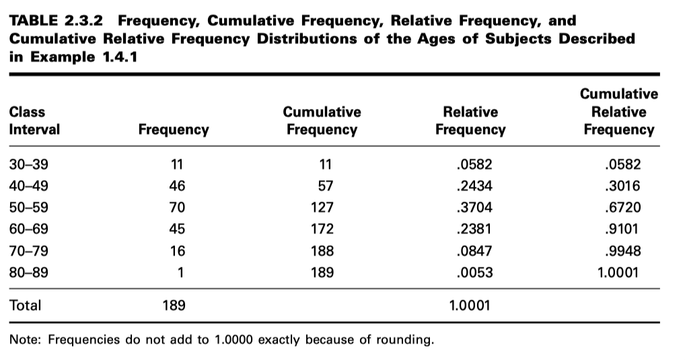
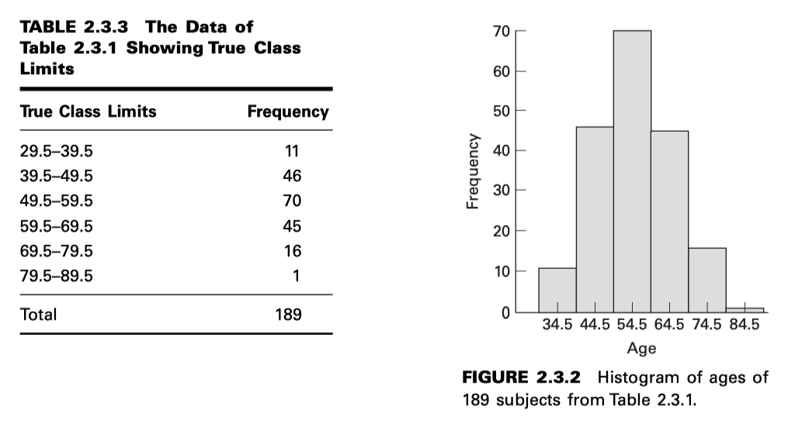
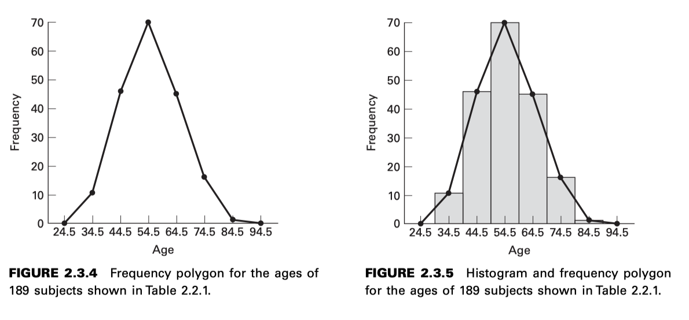
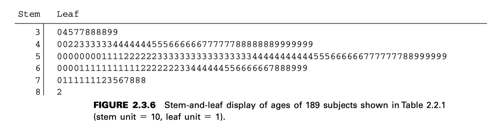
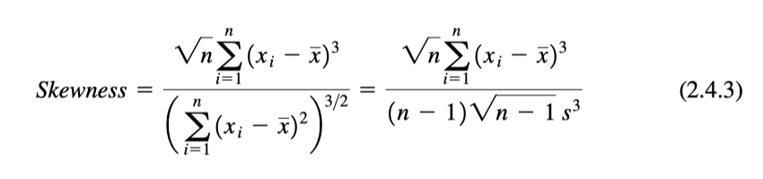
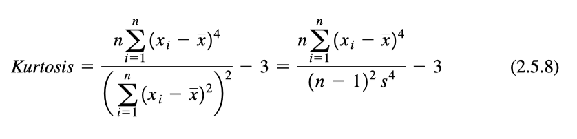
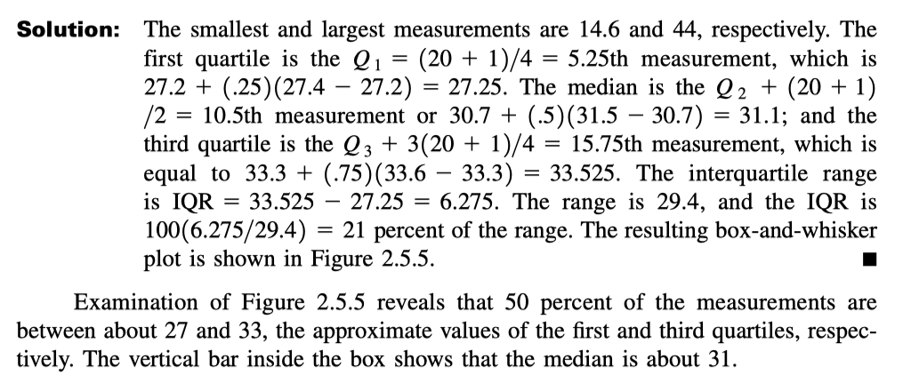
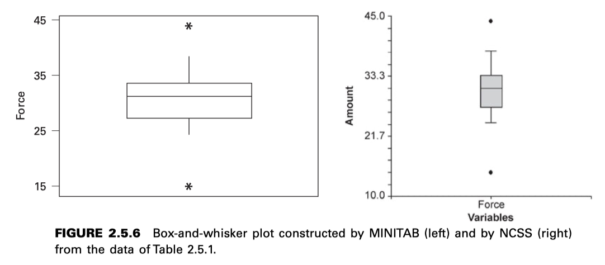

CHAPTER 2. Estadística Descriptiva
================================

DATOS AGRUPADOS: LA DISTRIBUCIÓN DE FRECUENCIAS
------------------------------------------------

ESTADÍSTICA DESCRIPTIVA: MEDIDAS DE TENDENCIA CENTRAL
-----------------------------------------------------

* media aritmética
* mediana
* simetria

ESTADÍSTICA DESCRIPTIVA: MEDIDAS DE DISPERSIÓN
----------------------------------------------

* varianza
* desviasión estandár
* rango intercuartil
* rango
* Curtosis

:text-blue:`EXAMPLE 2.5.5`

Evans et al. (A-7) examined the effect of velocity on ground reaction forces (GRF) in dogs with lameness from a torn cranial cruciate 
ligament. The dogs were walked and trotted over a force platform, and the GRF was recorded during a certain phase of their performance. 
Table 2.5.1 contains 20 measurements of force where each value shown is the mean of five force measurements per dog when trotting.

.. code:: R

   14.6, 31.5, 24.3, 31.6, 24.9, 32.3, 27.0, 32.8, 27.2, 33.3, 27.4, 33.6, 28.2, 34.3, 28.8, 36.9, 29.9, 38.3, 30.7, 44.0

**DEFINITION** An outlier is an observation whose value, x, either exceeds the value of the third quartile by a magnitude greater than 
1.5(IQR) or is less than the value of the first quartile by a magnitude greater than 1.5(IQR). That is, an observation of
:math:`x>Q_3 + 1.5(IQR)` or an observation of :math:`x < Q_1 - 1.5(IQR)` is called an outlier.

For the data in Table 2.5.1 we may use the previously computed values of :math:`Q_1` , :math:`Q_3`, and IQR to determine how large or how 
small a value 
would have to be in order to be considered an outlier. The calculations are as follows:

.. math::

   x > 27.25 - 1.5(6.275) = 17.8375 \text{ and } x > 33.525 + 1.5(6.275) = 42.9375

For the data in Table 2.5.1, then, an observed value smaller than 17.8375 or larger than 42.9375 would be considered an outlier.

.. math::

   \textcolor{blue}{\huge **TAREA \ para \ el \ jueves \ 5 \ de \ marzo**}

   \textcolor{red}{\huge 2.3.1, \ 2.3.2,\ 2.3.3, \ 2.5.1, \ 2.5.2,\ 2.5.3}

