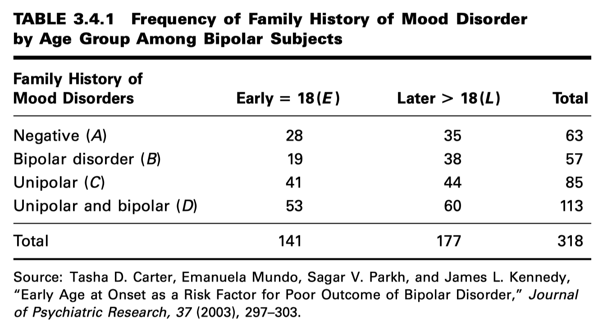

C03. ALGUNOS CONCEPTOS BÁSICOS DE PROBABILIDAD
==========================================

Probabilidad clásica
--------------------

**DEFINICIÓN.** Si un evento puede ocurrir de :math:`N` maneras mutuamente excluyentes e igualmente probables, y si :math:`m` 
de estas poseen 
un rasgo :math:`E`, la probabilidad de que ocurra :math:`E` es igual a :math:`m/N`.

Si leemos ``P(E)`` como “la probabilidad de E”, podemos expresar esta definición como

.. math:: 

   P(E) = \frac{m}{N}

Probabilidad de frecuencia relativa
-----------------------------------

**DEFINICIÓN.** Si un proceso se repite un gran número de veces, n, y si un evento resultante con la característica E ocurre 
m veces, la frecuencia relativa de ocurrencia de E, m/n, será aproximadamente igual a la probabilidad de E. 

Para expresar esta definición de forma compacta, escribimos:

.. math::

   P(E) = \frac{m}{n}

Sin embargo, debemos tener en cuenta que, estrictamente hablando, m/n es solo una estimación de P(E).

PROPIEDADES ELEMENTALES DE LA PROBABILIDAD
------------------------------------------

En 1933, el matemático ruso A. N. Kolmogorov formalizó el enfoque axiomático de la probabilidad. La base de este 
enfoque se fundamenta en tres propiedades a partir de las cuales se construye todo un sistema de teoría de la 
probabilidad mediante el uso de la lógica matemática. Las tres propiedades son las siguientes:

**1.** Dado un proceso (o experimento) con n resultados mutuamente excluyentes (llamados eventos), 
:math:`E_1, E_2, ..., E_n`, a la probabilidad de cualquier evento :math:`E_i` se le asigna un número no negativo. Es decir,

.. math::

   P(E_i) \geq 0 

En otras palabras, todos los eventos deben tener una probabilidad mayor o igual a cero.

Un concepto clave en el enunciado de esta propiedad es el de resultados 
mutuamente excluyentes. Se dice que dos eventos son mutuamente excluyentes si no pueden ocurrir simultáneamente.

**2.** La suma de las probabilidades de los resultados mutuamente excluyentes es igual a 1.

.. math::

   P(E_1) + P(E_2) + ... + P(E_n) = 1 

**3.** Consideremos dos eventos mutuamente excluyentes, :math:`E_i` y :math:`E_j`. 
La probabilidad de que ocurra :math:`E_i` o :math:`E_j` es igual a la suma de sus probabilidades individuales.

.. math::

   P(E_i + E_j) = P(E_i) + P(E_j)

CÁLCULO DE LA PROBABILIDAD DE UN EVENTO
---------------------------------------

**EJEMPLO 3.4.1**

El objetivo principal de un estudio de Carter et al. (A-1) fue investigar el efecto de la edad de inicio del trastorno bipolar en el curso de la enfermedad. Una de las variables investigadas fue el antecedente familiar de trastornos del estado de ánimo. La Tabla 3.4.1 muestra la frecuencia de un antecedente familiar de trastornos del estado de ánimo en los dos grupos de interés (edad de inicio temprana definida como 18 años o menos y edad de inicio tardía definida como después de los 18 años). Supongamos que elegimos una persona al azar de esta muestra. ¿Cuál es la probabilidad de que esta persona tenga 18 años o menos?

**Conditional Probability**

En ocasiones, el conjunto de “todos los resultados posibles” puede constituir un subconjunto del grupo total. En otras palabras, el tamaño del grupo de interés puede verse reducido por condiciones que no se aplican al grupo total. Cuando se calculan probabilidades utilizando un subconjunto del grupo total como denominador, el resultado es una probabilidad condicional.

La probabilidad calculada en el Ejemplo 3.4.1, por ejemplo, puede considerarse una probabilidad incondicional, ya que el tamaño del grupo total sirvió como denominador. No se impusieron condiciones para restringir el tamaño del denominador. También podemos considerar esta probabilidad como una probabilidad marginal, puesto que uno de los totales marginales se utilizó como numerador.

Podemos ilustrar el concepto de probabilidad condicional remitiéndonos nuevamente a la Tabla 3.4.1.

**EXAMPLE 3.4.2**

Supongamos que elegimos un sujeto al azar de entre 318 sujetos y encontramos que tiene 18 años o menos (E). 
¿Cuál es la probabilidad de que este sujeto sea uno que no tenga antecedentes familiares de trastornos del 
estado de ánimo (A)?

Probabilidad conjunta
---------------------

A veces queremos calcular la probabilidad de que un sujeto elegido al azar de un grupo posea dos características simultáneamente. Esta probabilidad se denomina probabilidad conjunta. Ilustramos el cálculo de una probabilidad conjunta con el siguiente ejemplo.

**EXAMPLE 3.4.3**

Consultemos nuevamente la Tabla 3.4.1. ¿Cuál es la probabilidad de que una persona elegida al azar entre los 318 sujetos sea Early 1E2 y sea una persona que no tenga antecedentes familiares de trastornos del estado de ánimo (A)?

La regla de la multiplicación
-----------------------------

Una probabilidad puede calcularse a partir de otras probabilidades. Por ejemplo, una probabilidad conjunta puede calcularse como el producto de una probabilidad marginal adecuada y una probabilidad condicional adecuada. Esta relación se conoce como la regla de multiplicación de probabilidades. Lo ilustramos con el siguiente ejemplo.

**EXAMPLE 3.4.4**

Deseamos calcular la probabilidad conjunta de inicio temprano de la enfermedad (E2) y antecedentes familiares negativos de trastornos del estado de ánimo (A) a partir del conocimiento de una probabilidad marginal apropiada y una probabilidad condicional apropiada.

**DEFINITION** La probabilidad condicional de A dado B es igual a la probabilidad de :math:`A \cup B` dividida por la probabilidad de B, siempre que la probabilidad de B no sea cero.

Es decir, ,

.. math::

   P(A|B) = \frac{P(A \cap B)}{P(B)}, \text{ con } P(B) \neq 0

The Addition Rule
----------------

**DEFINITION** Dados dos eventos A y B, la probabilidad de que ocurra el evento A, o el evento B, o ambos, es igual a la probabilidad de que ocurra el evento A, más la probabilidad de que ocurra el evento B, menos la probabilidad de que los eventos ocurran simultáneamente.

La regla de adición puede estar escrita

.. math::

   P(A \cap B) = P(A) + P(B) - P(A \cup B)

**EXAMPLE 3.4.6**

Si seleccionamos una persona al azar de los 318 sujetos representados en la Tabla 3.4.1, ¿cuál es la probabilidad de que esta persona sea un sujeto de inicio temprano (E2) o no tenga antecedentes familiares de trastornos del estado de ánimo (A) o ambas cosas?

Eventos independientes
----------------------

Suppose that, in Equation 3.4.2, we are told that event B has occurred, but that this fact has no effect on the 
probability of A. That is, suppose that the probability of event A is the same regardless of whether or not B occurs. In 
this situation, P1A ƒ B2 = P1A2. In such cases we say that A and B are independent events. The multiplication rule for 
two independent events, then, may be written as

.. math::

   P(A \cap B) = P(A)P(B), P(A) \neq 0, P(B) \neq 0

EXAMPLE 3.4.7

In a certain high school class, consisting of 60 girls and 40 boys, it is observed that 24 girls and 16 boys wear 
eyeglasses. If a student is picked at random from this class, the probability that the student wears eyeglasses, P(E), is 
40 ! 100, or .4.

(a) What is the probability that a student picked at random wears eyeglasses, given that the student is a boy?

(b) What is the probability of the joint occurrence of the events of wearing eyeglasses and being a boy?

**Complementary Events**

**Marginal Probability**

DEFINITION Given some variable that can be broken down into m categories designated by A 1 , A 2 , . . . , Ai , . . . , A 
and another jointly occurring variable that is broken down into nm categories designated by B1 , B2 , . . . , B j , . . . 
, B n , the marginal probability of A i , P1A i 2, is equal to the sum of the joint probabilities of A i with all the 
categories of B. That is,

P1A i 2 " g P1A i º B j 2,

for all values of j

(3.4.6)

EXAMPLE 3.4.9

We wish to use Equation 3.4.6 and the data in Table 3.4.1 to compute the marginal probability P(E).

