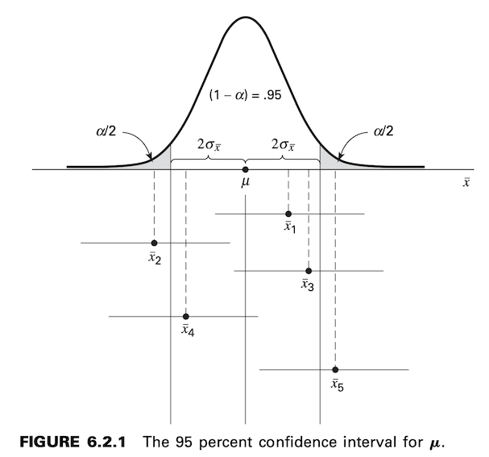

Estimación
==========

Se tiene algunas medidas que se tomaron de una población

.. math::

   x_1, x_2, x_3, ..., x_n

de estas medidadas deseamos estimar la media poblacional: :math:`\mu` y su varianza :math:`\sigma`.

Para esto, buscamos algunas fórmulas (**estimadores o estadística**) que estime estos parámetros (:math:`\mu, \sigma`) de la población.

**Algunos Estimadores Puntuales**

* media muestral

.. math::

   \bar{x} = \frac{\sum_{i=1}^n x_i}{n}

* mediana

* moda

* u Otra Fórmula

**Definición**

Se dice que un estimador, digamos T, del parámetro :math:`\Theta` es un estimador 
insesgado de :math:`\Theta` si :math:`E(T) = \Theta`.

**Intervalo de Confianza para la Media Poblacional**

**EJEMPLO 6.2.1**

Supongamos que un investigador, interesado en obtener una estimación del nivel 
promedio de alguna enzima en una determinada población humana, 
toma una muestra de 10 individuos, determina el nivel de la enzima en cada uno y 
calcula una media muestral de :math:`x = 22`. Supongamos además que se sabe que la 
variable de interés tiene una distribución aproximadamente normal con una 
varianza de 45. Deseamos estimar :math:`\mu`.

**Solución**

Un intervalo de confianza aproximado del 95 por ciento para :math:`\mu` viene dado por

.. math::

   \bar{x} \pm 2 \sigma_{\bar{x}}
   
   22 \pm 2 \sqrt{\frac{45}{10}}

   (17.76, 26.24)

**Componentes de la estimación por intervalos**

.. math::

   \bar{x} \pm z_{(1-\alpha/2)} \sigma_{\bar{x}}

**EJEMPLO 6.2.2**

Un fisioterapeuta deseaba estimar, con un 99% de confianza, la fuerza máxima 
promedio de un músculo específico en un grupo determinado de individuos. 
Partió de la base de que las puntuaciones de fuerza siguen una 
distribución aproximadamente normal con una varianza de 144. 
Una muestra de 15 sujetos que participaron en el experimento arrojó una media de 84.3.

**Solución:** (76.3, 92.3)

**Muestreo de poblaciones no normales**

**EJEMPLO 6.2.3**

La puntualidad de los pacientes en sus citas es de interés para un equipo de investigación. En un estudio sobre el flujo de pacientes en consultorios de médicos generales, se encontró que una muestra de 35 pacientes llegó tarde a sus citas, en promedio, 17.2 minutos. Investigaciones previas habían mostrado una desviación estándar de aproximadamente 8 minutos. Se consideró que la distribución de la población no era normal. ¿Cuál es el intervalo de confianza del 90% para :math:`\mu`, la verdadera media de retraso en las citas?

**Solución:** (15.0, 19.4)

**EJEMPLO 6.2.4**

A continuación se muestran los valores de actividad (micromoles por minuto por gramo de tejido) de una determinada enzima, medidos en tejido gástrico normal de 35 pacientes con carcinoma gástrico.

.360
1.827
.372
.610
.521
1.189
.537
.898
.319
.603
.614
.374
.411
.406
.533
.788
.449
.348
.413
.662
.273
.262
1.925
.767
1.177
2.464
.448
.550
.385
.307
.571
.971
.622
.674
1.499

Deseamos utilizar el paquete de software MINITAB para construir un intervalo de confianza del 95 % para la media poblacional. Supongamos que conocemos la varianza poblacional de 0,36. No es necesario asumir que la población muestreada de valores sigue una distribución normal, ya que el tamaño de la muestra es suficientemente grande para aplicar el teorema del límite central.

**6.3 LA DISTRIBUCIÓN t**

**Intervalo de Confianza usando t**

.. math::

   \bar{x} \pm t_{(1-\alpha/2)} \frac{s}{\sqrt{n}}

**EJEMPLO 6.3.1**

Maffulli et al. (A-1) estudiaron la efectividad de la movilización temprana del tobillo y la carga de peso tras la reparación aguda de una rotura del tendón de Aquiles. Una de las variables que midieron después del tratamiento fue la fuerza isométrica del músculo gastrocnemio-sóleo. En 19 sujetos, la fuerza isométrica media de la extremidad operada (en newtons) fue de 250,8 con una desviación estándar de 130,9. Suponemos que estos 19 pacientes constituyen una muestra aleatoria de una población de sujetos similares. Deseamos utilizar estos datos de muestra para estimar la fuerza isométrica media de la población después de la cirugía.

**Solución:** (187.7, 313.9)

**INTERVALO DE CONFIANZA PARA LA DIFERENCIA ENTRE DOS MEDIAS POBLACIONALES**

.. math::

   (\bar{x}_1 - \bar{x}_2) \pm z_{1-\alpha/2} \sqrt{\frac{\sigma_1^2}{n_1} + \frac{\sigma_2^2}{n_2} }

**EJEMPLO 6.4.1**

Un equipo de investigación está interesado en la diferencia entre los niveles 
de ácido úrico sérico en pacientes con y sin síndrome de Down. En un gran 
hospital para el tratamiento de personas con discapacidad intelectual, 
una muestra de 12 individuos con síndrome de Down arrojó una media de 
:math:`x_1 = 4.5` mg/100 ml. En un hospital general, una muestra de 15 
individuos normales de la misma edad y sexo presentó un valor medio de 
:math:`x_2 = 3.4`. Si es razonable suponer que las dos poblaciones de 
valores se distribuyen normalmente con varianzas iguales a 1 y 1,5, 
calcule el intervalo de confianza del 95% para :math:`\mu_1 - \mu_2`.

**Solución:** (.26, 1.94)

**Muestreo de poblaciones no normales**

**EJEMPLO 6.4.2**

A pesar del conocimiento generalizado de los efectos adversos de fumar, muchas mujeres continúan fumando durante el embarazo. Mayhew et al. (A-6) examinaron la efectividad de un programa para dejar de fumar dirigido a mujeres embarazadas. El número promedio de cigarrillos fumados diariamente al finalizar el programa por las 328 mujeres que lo completaron fue de 4,3 con una desviación estándar de 5,22. Entre las 64 mujeres que no completaron el programa, el número promedio de cigarrillos fumados por día al finalizar el programa fue de 13 con una desviación estándar de 8,97. Deseamos construir un intervalo de confianza del 99 % para la diferencia entre las medias de las poblaciones de las que se presume que se seleccionaron las muestras.

**Solución:** (-11.7, -5.7)

**La distribución t y la diferencia entre medias**

**Population Variances Equal**

El intervalo de confianza del :math:`100(1 - \alpha)` por ciento para 
:math:`\mu_1 - \mu_2` viene dado por

.. math::

   (\bar{x}_1 - \bar{x}_2) \pm t_{(1-\alpha/2)} \sqrt{\frac{s_p^2}{n_1} + \frac{s_p^2}{n_2} }

donde

.. math::

   s_p^2 = \frac{(n_1 -1)s_1^2 + (n_2 -1)s_2^2}{n_1 + n_2 -2}
   
El número de grados de libertad utilizados para determinar el valor de t 
que se utilizará para construir el intervalo es :math:`n_1 + n_2 - 2`.

**EJEMPLO 6.4.3**

El propósito de un estudio de Granholm et al. (A-7) fue determinar la efectividad de un programa integrado de tratamiento ambulatorio de doble diagnóstico para sujetos con enfermedades mentales. Los autores abordaron el problema del abuso de sustancias entre personas con trastornos mentales graves. Se realizó una revisión retrospectiva de historias clínicas de 50 pacientes consecutivos derivados al programa de Abuso de Sustancias/Enfermedad Mental en el Sistema de Atención Médica de la VA de San Diego. Una de las variables de resultado examinadas fue el número de días de tratamiento hospitalario por trastorno psiquiátrico durante el año posterior a la finalización del programa. Entre 18 sujetos con esquizofrenia, el número medio de días de tratamiento fue de 4,7 con una desviación estándar de 9,3. Para 10 sujetos con trastorno bipolar, el número medio de días de tratamiento por trastorno psiquiátrico fue de 8,8 con una desviación estándar de 11,5. Deseamos construir un intervalo de confianza del 95 por ciento para la diferencia entre las medias de las poblaciones representadas por estas dos muestras.

**Solución:** (-12.3, 4.10)

**Varianzas poblacionales no iguales**

El intervalo de confianza del :math:`100(1-\alpha)%` para el intervalo :math:`\mu_1 - \mu_2` esta dado como:

,, math::

   (\bar{x}_1 - \bar{x}_2) \pm t'_{(1-\alpha/2)} \sqrt{\frac{s_1^2}{n_1} + \frac{s_2^2}{n_2} }

donde

.. math::

   t'_{1-\alpha/2} = \frac{w_1 t_1 + w_2 t_2}{w_1 + w_2}

y :math:`w_1 = s_1^2, w_2 = s_2^2/n_2, t_1 = t_{1-\alpha/2}` para :math:`n_1-1` 
grados de libertad, y :math:`t_2 = t_{1-\alpha/2}` para :math:`n_2-1` grados de libertad.

**EJEMPLO 6.4.4**

Reexaminemos los datos presentados en el Ejemplo 6.4.3 del estudio de Granholm et al. (A-7). Recordemos que, entre los 18 sujetos con esquizofrenia, el número medio de días de tratamiento fue de 4,7 con una desviación estándar de 9,3. En el grupo de tratamiento para el trastorno bipolar, compuesto por 10 sujetos, el número medio de días de tratamiento para el trastorno psiquiátrico fue de 8,8 con una desviación estándar de 11,5. Suponemos que las dos poblaciones de días de tratamiento para el trastorno psiquiátrico se distribuyen aproximadamente de forma normal. Ahora bien, supongamos que las varianzas de las dos poblaciones no son iguales. Deseamos construir un intervalo de confianza del 95 % para la diferencia entre las medias de las dos poblaciones representadas por las muestras.

**Solución:** (-13.5, 5.3)

**6.9 INTERVALO DE CONFIANZA PARA LA VARIANZA DE UNA POBLACIÓN CON DISTRIBUCIÓN NORMAL**

El intervalo de confianza del :math:`100(1 - \alpha)` por ciento para :math:`\sigma`,
 la desviación estándar de la población:

.. math::

   \sqrt{\frac{(n-1)s^2}{\chi^2_{1-(\alpha/2)}}} < \sigma <  \sqrt{\frac{(n-1)s^2}{\chi^2_{\alpha/2}}}

**EJEMPLO 6.9.1**

En un estudio sobre la efectividad de una dieta sin gluten en familiares de primer grado de pacientes con diabetes tipo I, Hummel et al. (A-22) sometieron a siete sujetos a una dieta sin gluten durante 12 meses. Antes de la dieta, se tomaron mediciones basales de varios anticuerpos y autoanticuerpos, uno de los cuales fue el autoanticuerpo de insulina relacionado con la diabetes (IAA). Los niveles de IAA se midieron mediante ensayo de unión radioquímica. Los siete sujetos tenían unidades de IAA de

9.7, 12.3, 11.2, 5.1, 24.8, 14.8, 17.7

**Solución:** :math:`4.063 < \sigma < 13.888`

**6.10 INTERVALO DE CONFIANZA PARA LA RAZÓN DE LAS VARIANZAS DE DOS POBLACIONES CON DISTRIBUCIÓN NORMAL**

Para hallar el intervalo de confianza del :math:`100(1 - \alpha)` por 
ciento para :math:`\sigma_1^2/\sigma_2^2`, comenzamos con la expresión

.. math::

   \frac{s_1^2/s_2^2}{F_{1-(\alpha/2)}} < \frac{\sigma_1^2}{\sigma_2^2} < \frac{s_1^2/s_2^2}{F_{\alpha/2}}

**EJEMPLO 6.10.1**

Allen y Gross (A-25) examinan la fuerza de los flexores de los dedos en sujetos con fascitis plantar (dolor por espolones calcáneos o dolor general en el talón), una afección común en pacientes con problemas musculoesqueléticos. La inflamación de la fascia plantar suele ser costosa de tratar y frustrante tanto para el paciente como para el médico. Una de las mediciones iniciales fue el índice de masa corporal (IMC). Para las 16 mujeres del estudio, la desviación estándar del IMC fue de 8,1 y para los cuatro hombres del estudio, la desviación estándar fue de 5,9. Deseamos construir un intervalo de confianza del 95 % para la razón de las varianzas de las dos poblaciones de las que suponemos que se extrajeron estas muestras.

**Solución:**

.. math::

   .1323 < \frac{\sigma_1^2}{\sigma_2^2} < 7.8221

