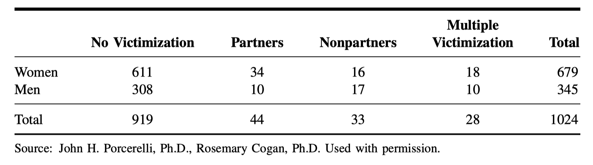

EJERCICIOS
==========

3.4.1 In a study of violent victimization of women and men, Porcerelli et al. (A-2) collected 
information from 679 women and 345 men aged 18 to 64 years at several family practice centers in the 
metropolitan Detroit area. Patients filled out a health history questionnaire that included a question 
about victimization. The following table shows the sample subjects cross-classified by sex and the type 
of 
violent victimization reported. The victimization categories are defined as no victimization, partner 
victimization (and not by others), victimization by persons other than partners (friends, family 
members, or strangers), and those who reported multiple victimization.

3.4.1 En un estudio sobre la victimización violenta de mujeres y hombres, Porcerelli et al. (A-2) 
recopilaron información de 679 mujeres y 345 hombres de entre 18 y 64 años en varios centros de 
medicina familiar del área metropolitana de Detroit. Los pacientes completaron un cuestionario de 
historial médico que incluía una pregunta sobre victimización. La siguiente tabla muestra los sujetos 
de la muestra clasificados por sexo y el tipo de victimización violenta reportada. Las categorías de 
victimización se definen como ninguna victimización, victimización por parte de la pareja (y no por 
otras personas), victimización por personas distintas a la pareja (amigos, familiares o desconocidos) y 
aquellos que reportaron victimización múltiple.

(a) Suppose we pick a subject at random from this group. What is the probability that this subject will be a woman?

(b) What do we call the probability calculated in part a?

(c) Show how to calculate the probability asked for in part a by two additional methods.

(d) If we pick a subject at random, what is the probability that the subject will be a woman and have experienced partner abuse?

(e) What do we call the probability calculated in part d?

(f) Suppose we picked a man at random. Knowing this information, what is the probability that he experienced abuse from nonpartners?

(g) What do we call the probability calculated in part f?

(h) Suppose we pick a subject at random. What is the probability that it is a man or someone who experienced abuse from a partner?

(i) What do we call the method by which you obtained the probability in part h?

3.5.1 A medical research team wishes to assess the usefulness of a certain symptom (call it S) in the 
diagnosis of a particular disease. In a random sample of 775 patients with the disease, 744 reported 
having the symptom. In an independent random sample of 1380 subjects without the disease, 21 reported 
that they had the symptom.

3.5.1 Un equipo de investigación médica desea evaluar la utilidad de un síntoma determinado (llamémoslo 
S) en el diagnóstico de una enfermedad específica. En una muestra aleatoria de 775 pacientes con la 
enfermedad, 744 informaron tener el síntoma. En una muestra aleatoria independiente de 1380 sujetos sin 
la enfermedad, 21 informaron tener el síntoma.

(a) In the context of this exercise, what is a false positive?

(b) What is a false negative?

(c) Compute the sensitivity of the symptom.

(d) Compute the specificity of the symptom.

(e) Suppose it is known that the rate of the disease in the general population is .001. What is the predictive value positive of the symptom?

(f) What is the predictive value negative of the symptom?

(g) Find the predictive value positive and the predictive value negative for the symptom for the following hypothetical disease rates: .0001, .01, and .10.

(h) What do you conclude about the predictive value of the symptom on the basis of the results obtained in part g?

**In each of the following exercises, assume that N is sufficiently large relative to n that the 
binomial 
distribution may be used to find the desired probabilities**

4.3.1 Based on data collected by the National Center for Health Statistics and made available to the 
public in the Sample Adult database (A-5), an estimate of the percentage of adults who have at some 
point in their life been told they have hypertension is 23.53 percent. If we select a simple random 
sample of 20 U.S. adults and assume that the probability that each has been told that he or she has 
hypertension is .24, find the probability that the number of people in the sample who have been told 
that they have hypertension will be:

(a) Exactly three 

(b) Three or more

(c) Fewer than three 

(d) Between three and seven, inclusive

4.4.1 Singh et al. (A-8) looked at the occurrence of retinal capillary hemangioma (RCH) in patients 
with von Hippel–Lindau (VHL) disease. RCH is a benign vascular tumor of the retina. Using a 
retrospective consecutive case series review, the researchers found that the number of RCH tumor
incidents followed a Poisson distribution with l = 4 tumors per eye for patients with VHL. Using this 
model, find the probability that in a randomly selected patient with VHL:

(a) There are exactly five occurrences of tumors per eye.

(b) There are more than five occurrences of tumors per eye.

(c) There are fewer than five occurrences of tumors per eye.

(d) There are between five and seven occurrences of tumors per eye, inclusive.

**Given the standard normal distribution find**

4.6.1 The area under the curve between z = 0 and z = 1.43

4.6.2 The probability that a z picked at random will have a value between z = -2.87 and z = 2.64

4.6.7 :math:`P(-1.96 \leq z \leq 1.96)`

4.6.8 :math:`P`(-2.58 \leq z \leq 2.582`

4.7.1 For another subject (a 29-year-old male) in the study by Diskin et al. (A-11), acetone levels 
were normally distributed with a mean of 870 and a standard deviation of 211 ppb. Find the probability 
that on a given day the subject’s acetone level is:

(a) Between 600 and 1000 ppb

(b) Over 900 ppb

(c) Under 500 ppb

(d) Between 900 and 1100 ppb

4.7.3 One of the variables collected in the North Carolina Birth Registry data (A-3) is pounds gained 
during pregnancy. According to data from the entire registry for 2001, the number of pounds gained 
during pregnancy was approximately normally distributed with a mean of 30.23 pounds and a standard 
deviation of 13.84 pounds. Calculate the probability that a randomly selected mother in North Carolina 
in 2001 gained:

(a) Less than 15 pounds during pregnancy 

(b) More than 40 pounds

(c) Between 14 and 40 pounds 

(d) Less than 10 pounds

(e) Between 10 and 20 pounds

