BIOSTATISTICS_Daniel
====================

**CHAPTER 1. INTRODUCTION TO BIOSTATISTICS**

1.1 INTRODUCTION

1.2 SOME BASIC CONCEPTS

1.3 MEASUREMENT AND MEASUREMENT SCALES

1.4 SAMPLING AND STATISTICAL INFERENCE

1.5 THE SCIENTIFIC METHOD AND THE DESIGN OF EXPERIMENTS

1.6 COMPUTERS AND BIOSTATISTICAL ANALYSIS

1.7 SUMMARY

**CHAPTER 2 DESCRIPTIVE STATISTICS**

2.1 INTRODUCTION

2.2 THE ORDERED ARRAY

.. code:: R

   sort(), min(), max(), length(), dim(), acos(), cos(), list(), apply(), array(),
   asin(), sin(), tan(), atan(), cat(), round(), cbind, rbind(), cumsum(), cujmmin(),
   attach(), detach(), exp(), library(), log(), rep(), save(), sample(), table(),
   

2.3 GROUPED DATA: THE FREQUENCY DISTRIBUTION

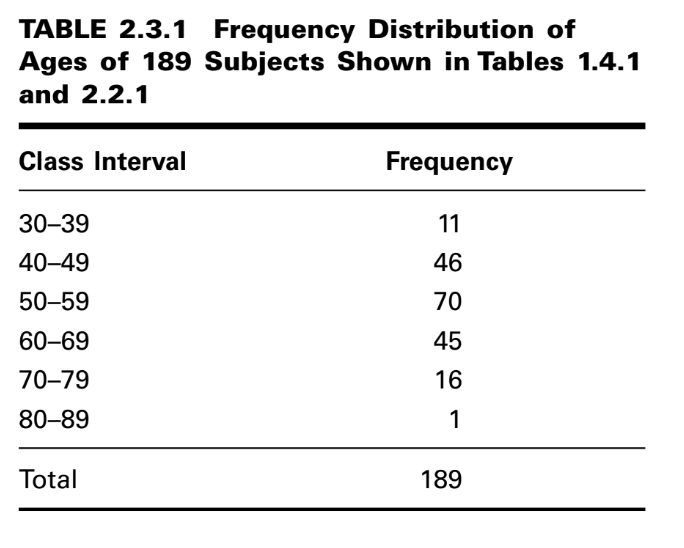

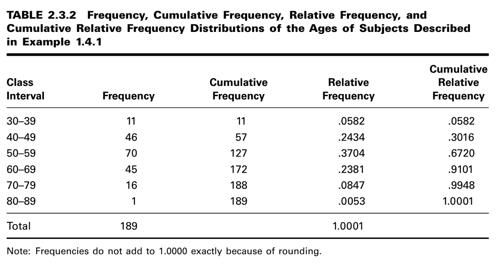

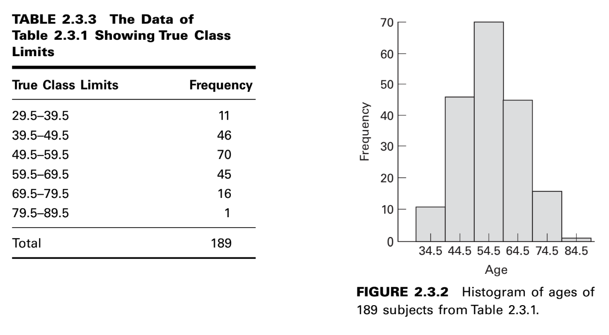

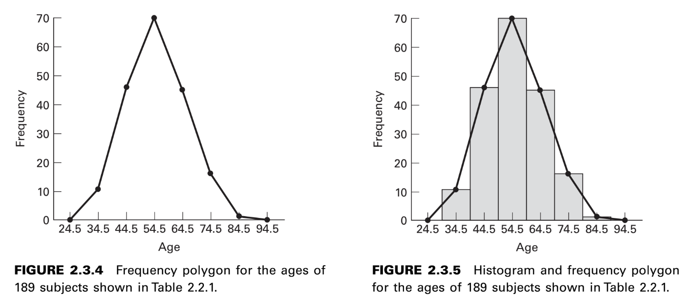

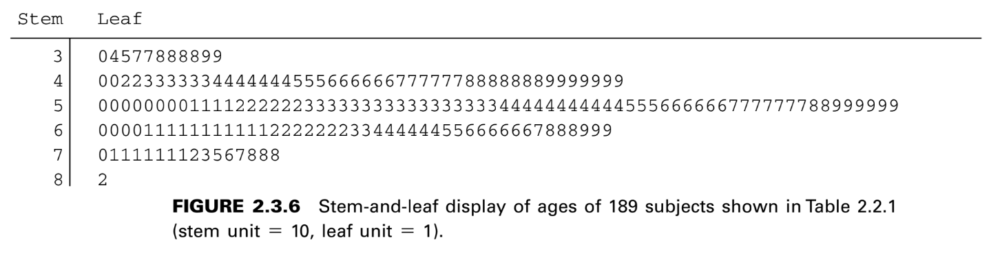

2.4 DESCRIPTIVE STATISTICS: MEASURES OF CENTRAL TENDENCY

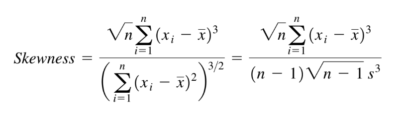

2.5 DESCRIPTIVE STATISTICS: MEASURES OF DISPERSION

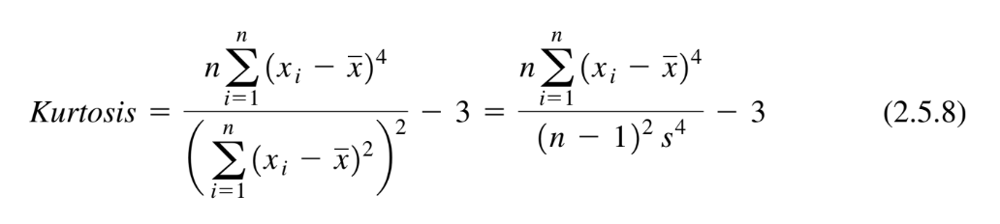

**CHAPTER 3 SOME BASIC PROBABILITY CONCEPTS**

3.1 INTRODUCTION

3.2 TWO VIEWS OF PROBABILITY: OBJECTIVE AND SUBJECTIVE

3.3 ELEMENTARY PROPERTIES OF PROBABILITY

3.4 CALCULATING THE PROBABILITY OF AN EVENT

3.5 BAYES’ THEOREM, SCREENING TESTS, SENSITIVITY, SPECIFICITY, AND PREDICTIVE VALUE POSITIVE AND NEGATIVE

3.6 SUMMARY

**CHAPTER 4 PROBABILITY DISTRIBUTIONS**

4.1 INTRODUCTION

4.2 PROBABILITY DISTRIBUTIONS OF DISCRETE VARIABLES

4.3 THE BINOMIAL DISTRIBUTION

4.4 THE POISSON DISTRIBUTION

4.5 CONTINUOUS PROBABILITY DISTRIBUTIONS

4.6 THE NORMAL DISTRIBUTION

.. math::

   f(x) = \frac{1}{\sqrt{2\pi \sigma}} e^{-(x-\mu)^2/2\sigma^2}, -\infty < x < \infty

**Characteristics of the Normal Distribution**

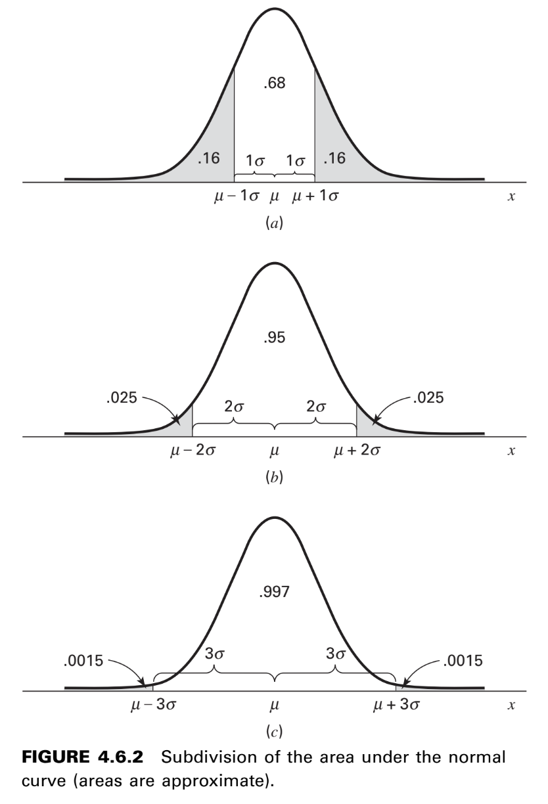

**The Standard Normal Distribution**

.. math::

   f(z) = \frac{1}{\sqrt{2\pi}} e^{-z^2/2}, -\infty < z < \infty

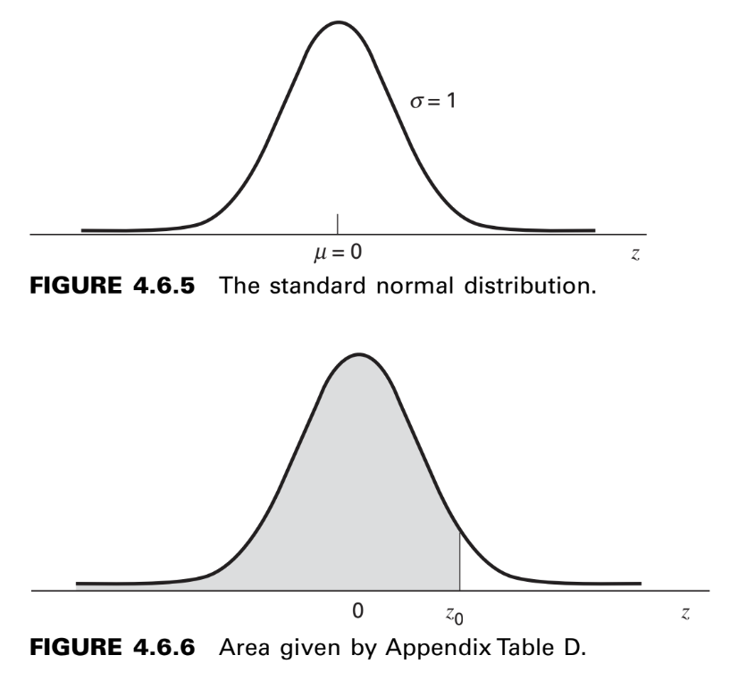

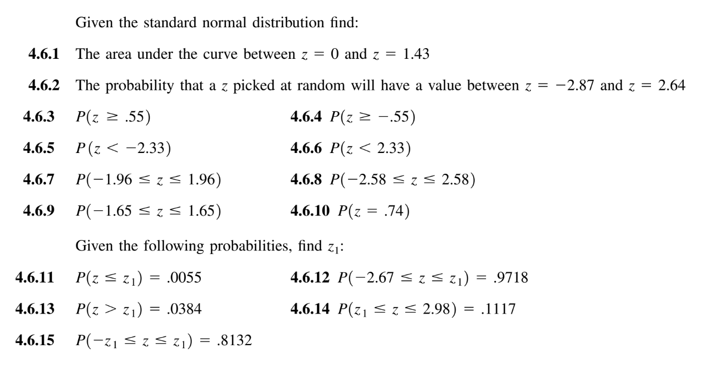

4.7 NORMAL DISTRIBUTION APPLICATIONS

**CHAPTER 5 SOME IMPORTANT SAMPLING DISTRIBUTIONS**

5.1 INTRODUCTION

5.2 SAMPLING DISTRIBUTIONS

5.3 DISTRIBUTION OF THE SAMPLE MEAN

**The Central Limit Theorem**

Given a population of any nonnormal functional form with a mean :math:`\mu` and finite
variance :math:`\sigma^2`, the sampling distribution of :math:`\bar{x}`, computed from samples of size n from
this population, will have mean :math:`\mu` and variance :math:`\sigma^2/n` and will be approximately
normally distributed when the sample size is large.

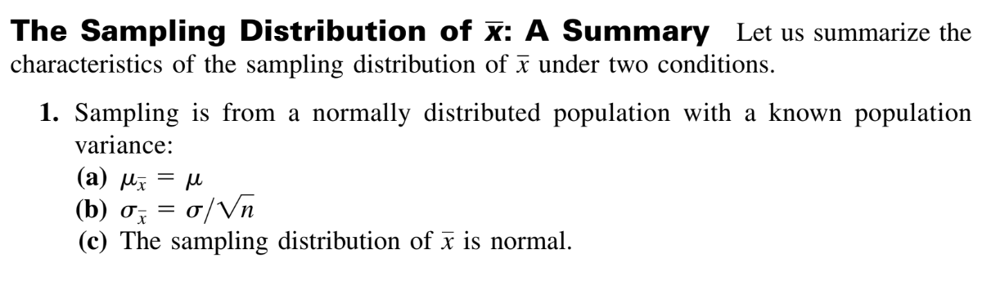

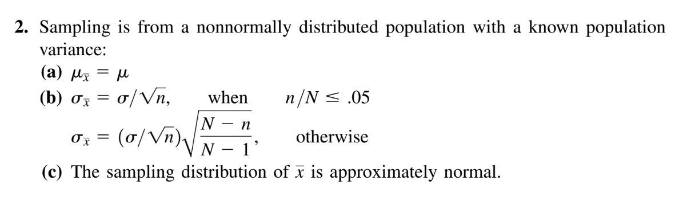

5.4 DISTRIBUTION OF THE DIFFERENCE BETWEEN TWO SAMPLE MEANS

.. math::

   z = \frac{(\bar{x}_1 - \bar{x}_2) - (\mu_1 - \mu_2)}{\sqrt{\frac{\sigma_1^2}{n_1} + \frac{\sigma_2^2}{n_2}}}

5.5 DISTRIBUTION OF THE SAMPLE PROPORTION

.. mat::

   z = \frac{\hat{p} - p}{\sqrt{\frac{p(1-p)}{n}}}

5.6 DISTRIBUTION OF THE DIFFERENCE BETWEEN TWO SAMPLE PROPORTIONS

**CHAPTER 6 ESTIMATION**

6.1 INTRODUCTION

**DEFINITION**

Statistical inference is the procedure by which we reach a conclusion
about a population on the basis of the information contained in a
sample drawn from that population.

**DEFINITION**

A point estimate is a single numerical value used to estimate the
corresponding population parameter.

**DEFINITION**

An interval estimate consists of two numerical values defining a range
of values that, with a specified degree of confidence, most likely
includes the parameter being estimated.

6.2 CONFIDENCE INTERVAL FOR A POPULATION MEAN

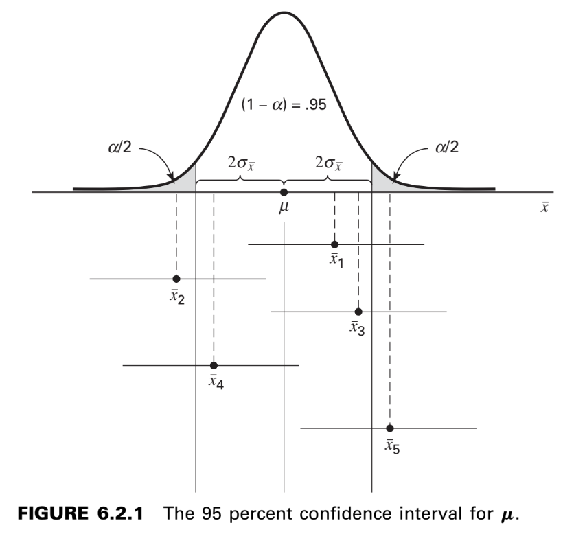

**Interval Estimate Components**

In general, then, an interval estimate may be expressed as follows:

estimator :math:`\pm` (reliability coefficient) :math:`\times` (standard error)       (6.2.1)

In particular, when sampling is from a normal distribution with known variance,
an interval estimate for :math:`\mu` may be expressed as

.. math::

   \bar{x} \pm z_{(1-\alpha/2)} \sigma_{\bar{x}}

where :math:`z_{(1-\alpha/2)}` is the value of z to the left of which lies :math:`1-\alpha/2` and to the right of
which lies :math:`\alpha/2` of the area under its curve.

**Sampling from Nonnormal Populations**

**6.3 THE t DISTRIBUTION**

**Confidence Intervals Using t**

.. math::

   \bar{x} \pm t_{(1- \alpha/2)} \frac{s}{\sqrt{n}}

6.4 CONFIDENCE INTERVAL FOR THE DIFFERENCE BETWEEN TWO POPULATION MEANS

**Population Variances Equal**

.. math::

   s_p^2 = \frac{(n_1-1)s_1^2 + (n_2-1)s_2^2}{n_1 + n_2 -2}

The standard error of the estimate, then, is given by

.. math::

   s_{\bar{x}_1 - \bar{x}_2} = \sqrt{\frac{s_p^2}{n_1} + \frac{s_p^2}{n_2}}

and the :math:`100(1-\alpha)` percent confidence interval for is given by 

.. math::

   (\bar{x}_1 - \bar{x}_2) \pm t_{(1-\alpha/2)} \sqrt{\frac{s_p^2}{n_1} + \frac{s_p^2}{n_2}}

The number of degrees of freedom used in determining the value of t to use in constructing the interval is
:math:`n_1 + n_2 - 2`

**Population Variances Not Equal**

The solution proposed by Cochran consists of computing the reliability factor, :math:`t'_{1-\alpha/2}` by the following formula:

.. math::

   t'_{1-\alpha/2} = \frac{w_1t_1 + w_2 t_2}{w_1 + w_2}

where :math:`w_1=s_1^2/n_1, w_2=s_2^2/n_2,  t_1=t_{1-\alpha/2}` for :math:`n_1-1` degrees of freedom, and :math:`t_2=t_{1-\alpha/2}`
for :math:`n_2-1`  degrees of freedom. An approximate :math:`100(1-\alpha)` percent confidence
interval for :math:`\mu_1 - \mu_2` is given by

.. math::

   (\bar{x}_1  - \bar{x}_2) \pm t'_{(1-\alpha/2)} \sqrt{\frac{s_1^2}{n_1} + \frac{s_2^2}{n_2}}

6.5 CONFIDENCE INTERVAL FOR A POPULATION PROPORTION

6.6 CONFIDENCE INTERVAL FOR THE DIFFERENCE BETWEEN TWO POPULATION PROPORTIONS

6.7 DETERMINATION OF SAMPLE SIZE FOR ESTIMATING MEANS

6.8 DETERMINATION OF SAMPLE SIZE FOR ESTIMATING PROPORTIONS

6.9 CONFIDENCE INTERVAL FOR THE VARIANCE OF A NORMALLY DISTRIBUTED POPULATION

6.10 CONFIDENCE INTERVAL FOR THE RATIO OF THE VARIANCES OF TWO NORMALLY DISTRIBUTED POPULATIONS

**CHAPTER 7 HYPOTHESIS TESTING**

7.1 INTRODUCTION

**DEFINITION**

A hypothesis may be defined simply as a statement about one or more populations.

**DEFINITION**

The level of significance is a probability and, in fact, is the probability
of rejecting a true null hypothesis.

7.2 HYPOTHESIS TESTING: A SINGLE POPULATION MEAN

7.3 HYPOTHESIS TESTING: THE DIFFERENCE BETWEEN TWO POPULATION MEANS

7.4 PAIRED COMPARISONS

7.5 HYPOTHESIS TESTING: A SINGLE POPULATION PROPORTION

7.6 HYPOTHESIS TESTING: THE DIFFERENCE BETWEEN TWO POPULATION PROPORTIONS

7.7 HYPOTHESIS TESTING: A SINGLE POPULATION VARIANCE

7.8 HYPOTHESIS TESTING: THE RATIO OF TWO POPULATION VARIANCES

7.9 THE TYPE II ERROR AND THE POWER OF A TEST

7.10 DETERMINING SAMPLE SIZE TO CONTROL TYPE II ERRORS

**CHAPTER 8 ANALYSIS OF VARIANCE**

8.1 INTRODUCTION

8.2 THE COMPLETELY RANDOMIZED DESIGN

**One-Way ANOVA**

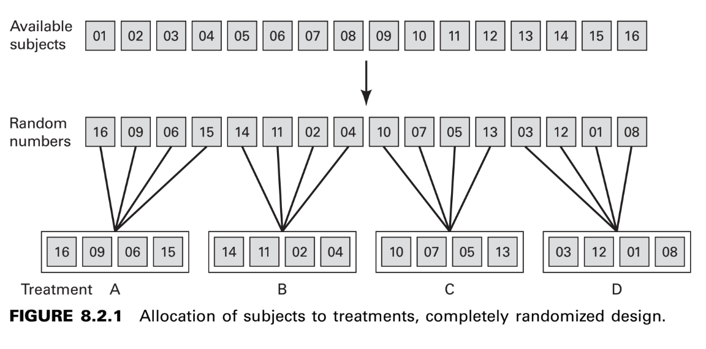

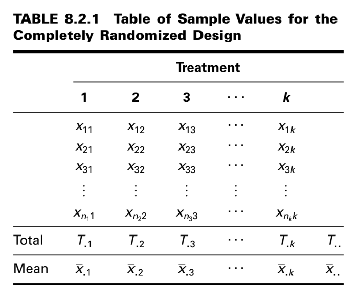

**The F Test**

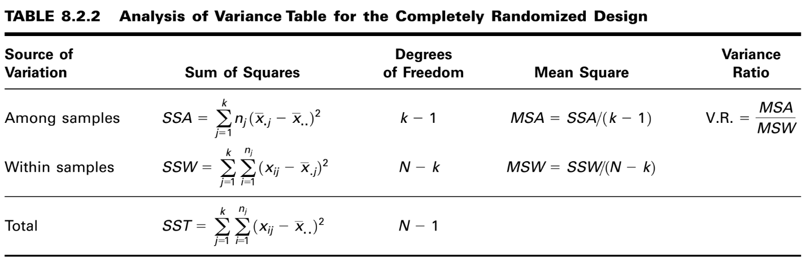

**Tukey’s HSD Test**

**Bonferroni’s Method**

8.3 THE RANDOMIZED COMPLETE BLOCK DESIGN

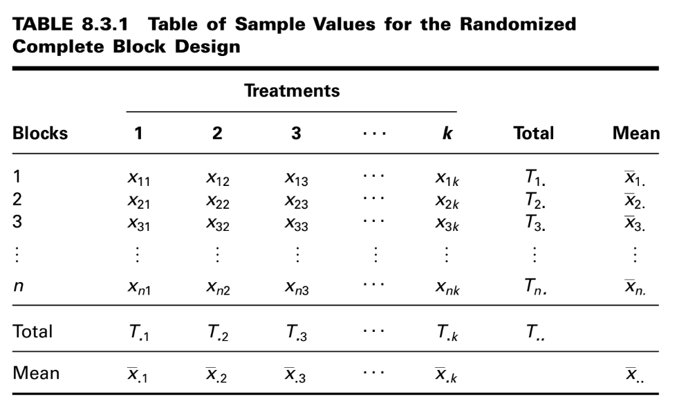

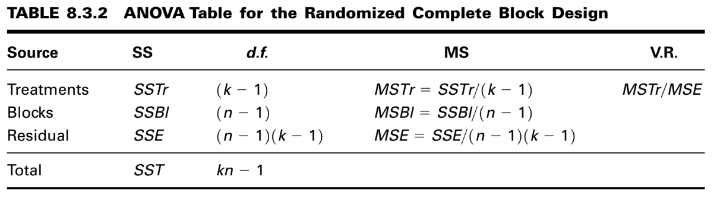

8.4 THE REPEATED MEASURES DESIGN

8.5 THE FACTORIAL EXPERIMENT

**CHAPTER 9 SIMPLE LINEAR REGRESSION AND CORRELATION**

9.1 INTRODUCTION

9.2 THE REGRESSION MODEL

.. math::

   y = \beta_0 + \beta_1 x + \varepsilon

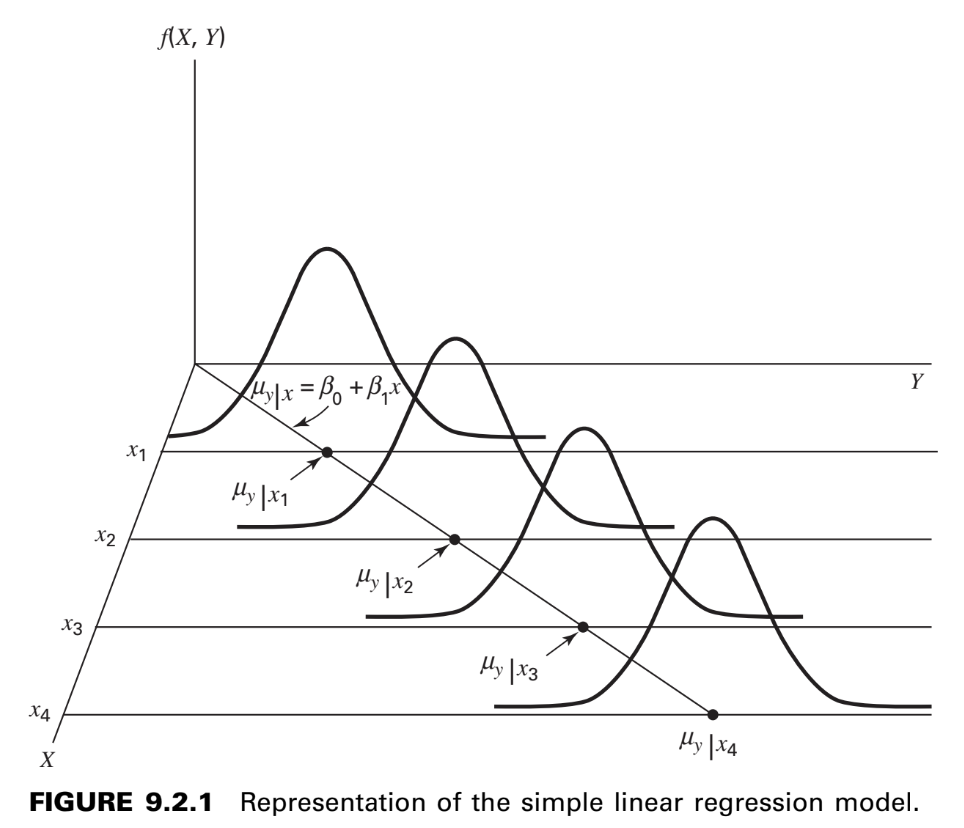

9.3 THE SAMPLE REGRESSION EQUATION

9.4 EVALUATING THE REGRESSION EQUATION

When :math:`H_0: \beta_1 = 0` Is Not Rejected

When :math:`H_0: \beta_1 = 0` Is Rejected

**The Coefficient of Determination** One way to evaluate the strength of
the regression equation is to compare the scatter of the points about the regression line
with the scatter about :math:`\bar{y}` the mean of the sample values of Y.

9.5 USING THE REGRESSION EQUATION

9.6 THE CORRELATION MODEL

9.7 THE CORRELATION COEFFICIENT

9.8 SOME PRECAUTIONS

**CHAPTER10 MULTIPLE REGRESSION AND CORRELATION**

