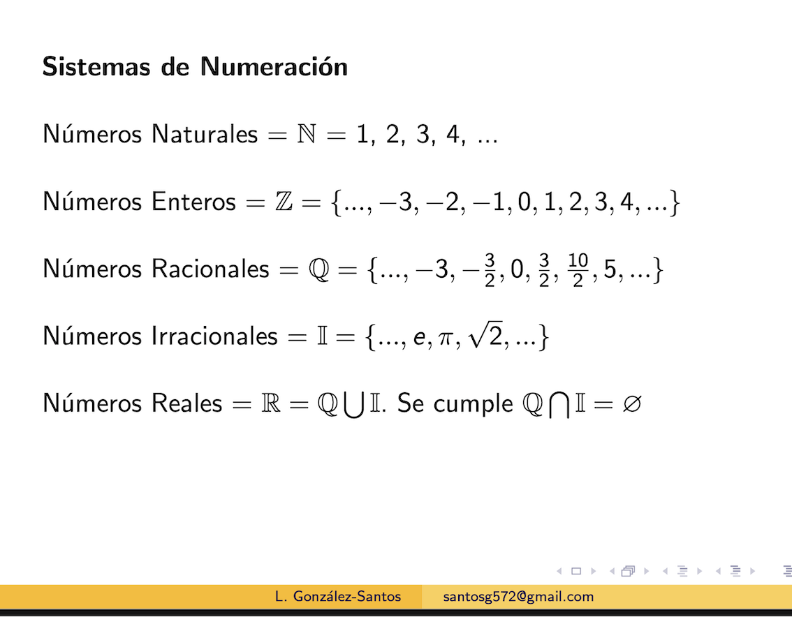
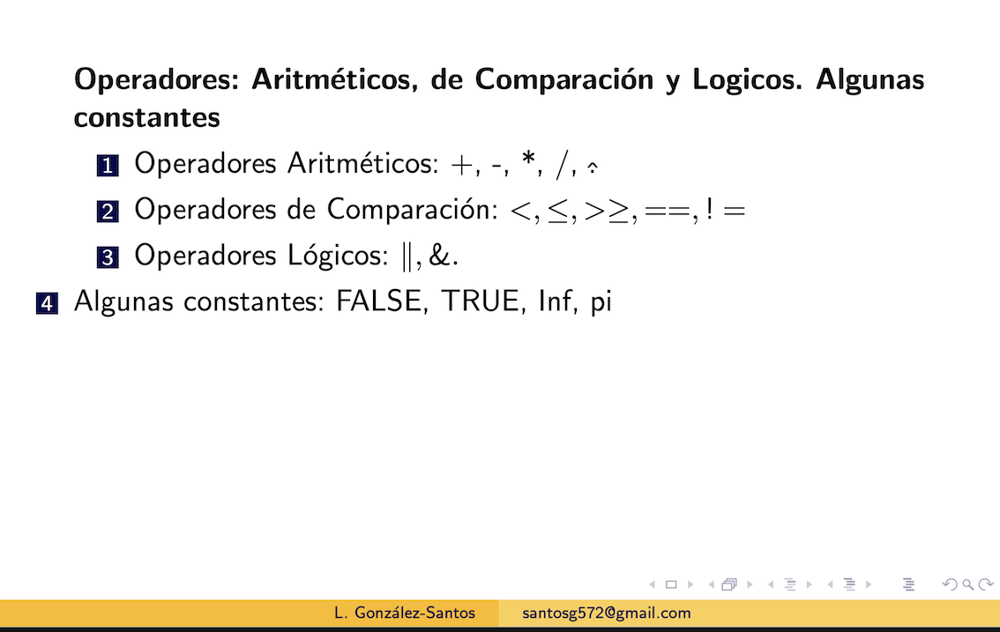
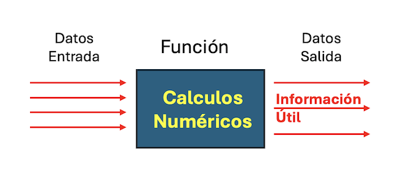
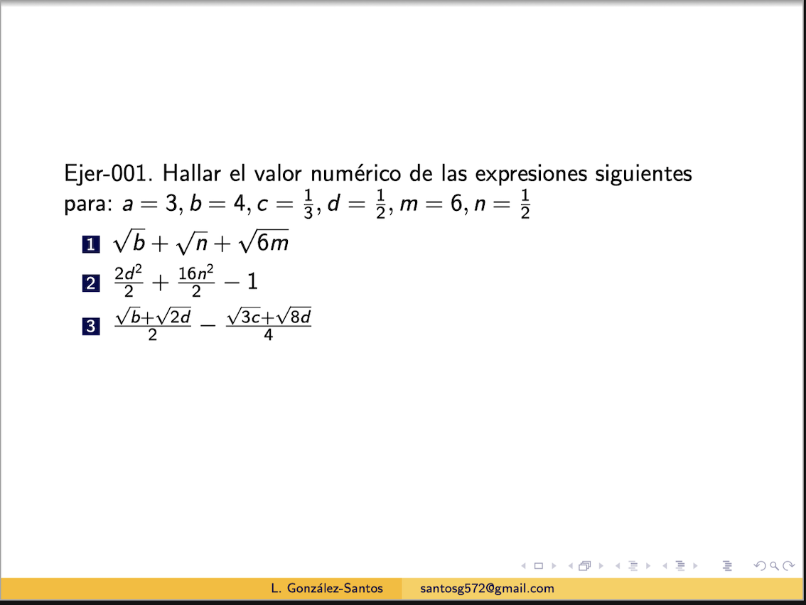

Contenido
========

1. Sistemas de Numeración
2. Operadores: Aritméticos, de Comparación y Lógicos. Algunas Constantes.
3. Funciones matemáticas
4. Algunos Calculos Numéricos 
5. Scripts. Folder de trabajo
6. Vectores

------------------------------------------------------------------------

------------------------------------------------------------------------

------------------------------------------------------------------------

------------------------------------------------------------------------

**Algunas Funciones Aritméticas**

.. code:: Bash

   cos(x)

   sin(x)
   
   exp(x)

   factorial(x)

   log10(x)

   log(x)

   mean(x)

Algunos ejercicios:

1.
---------------------------------------------

2. 
-------------------------------------------------

:doc:`configurar-directorio-r`

   
   
