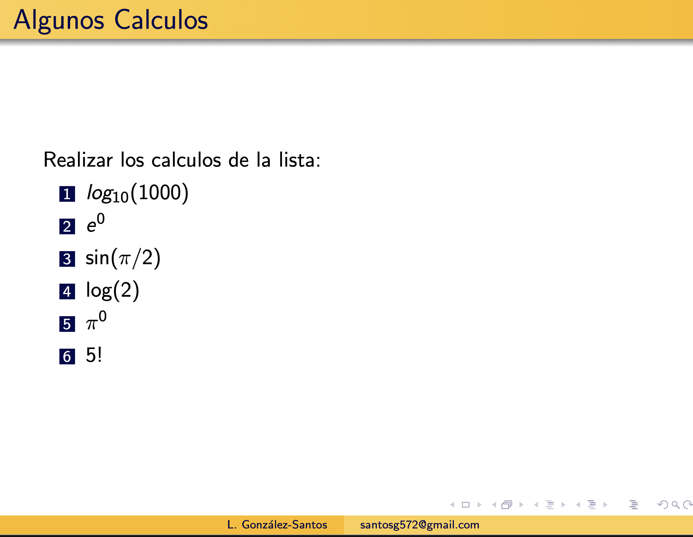

R como Calculadora
==================

Levante R y mostrara la siguiente ventana:

.. image:: r01.png

El símbolo **">"** que se muestra al final es llamado **Prompt** y quiere decir que estamos interactuando con el lenguaje R, es decir, espera ordenes o 
comandos para ejecutar.
 
ejemplo-01.

.. code:: Bash

   > print("Hola Mundo!")

ejemplo-02. Resolver la ecuacion de 2o. grado: 3x^2 - 2x +1 = 0

.. code:: Bash

   > x1 = (8 + sqrt((-8)*(-8) - 4*3*1))/(2*3)

   > x1

Verificando que es raíz:

.. code:: Bash

   > 3*x1^2 - 8*x1 +1

   [1] 0

Claculando 2a. raíz:

.. code:: Bash

   > x2 = (8 - sqrt((-8)*(-8) - 4*3*1))/(2*3)

   > 3*x2^2 - 8*x2 +1
   
   [1] -4.440892e-16

Otra manera de calcularlo:

.. code:: Bash

   > a=3; b=-8;c=1

   > x1 = (-b + sqrt(b^2 - 4*a*c))/(2*a)

   > a*x1^2 + b*x1 +c

   [1] 0

Calcular lo siguiente:

