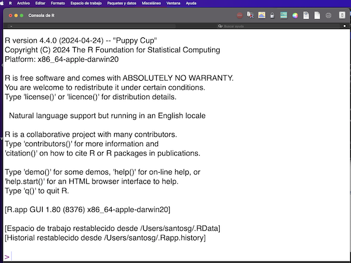

R como Calculadora
==================

Levante R y mostrara la siguiente ventana:

El símbolo **">"** que se muestra al final es llamado **Prompt** y quiere decir que estamos interactuando con el lenguaje R, es decir espera ordenes o 
comandos para ejecutar.
 
ejemplo-01.

.. code:: Bash

   > print("Hola Mundo!")

e02.

> 3x^2 - 2x +1 = 0

> x1 = (8 + sqrt((-8)*(-8) - 4*3*1))/(2*3)
> x1

> 3*x1^2 - 8*x1 +1
[1] 0

> x2 = (8 - sqrt((-8)*(-8) - 4*3*1))/(2*3)
> 3*x2^2 - 8*x2 +1
[1] -4.440892e-16

e03.

> a=3; b=-8;c=1
> x1 = (-b + sqrt(b^2 - 4*a*c))/(2*a)
> a*x1^2 + b*x1 +c
[1] 0

e04.

(base) iMac-de-Fernando:Programas santosg$ ./compR.sh p2
[1] 2.535184
[1] 0.1314829
[1] 0
[1] -4.440892e-16

(base) iMac-de-Fernando:Programas santosg$ cat compR.sh 
#!/bin/bash

Rscript $1".R"

(base) iMac-de-Fernando:Programas santosg$ cat p2.R 
a=3; b=-8;c=1

x1 = (-b + sqrt(b^2 - 4*a*c))/(2*a)
x2 = (-b - sqrt(b^2 - 4*a*c))/(2*a)

print(x1)
print(x2)

print(a*x1^2+b*x1+c)

print(a*x2^2+b*x2+c)

.. image:: rstudio.png 

> getwd()

> ??install.packages

> installed.packages()

> packageDescription("stats")

> help(package = "stats")

