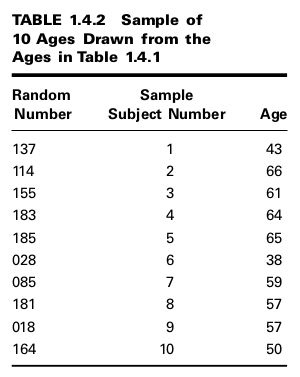

Conceptos Basicos
=================

- ``Estadística``

- ``Variable``

- ``Variables Cuantitativas``

- ``Variables Cualitativas``

- ``Variables Aleatorias``

- ``Variables Aleatorias Discretas``

- ``Variables Aleatorias Continuas``

- ``Población**

- ``Muestra``

Medición y Escalas de Medición
-----------------------------

- ``Escala Nomial``

- ``Escala Ordinal``

- ``Escala Intervalo``

- ``Escala de Razon``

Muestreo e Inferencia Estadística
---------------------------------

**Ejemplo**. Gold et al. (A-1) studied the effectiveness on smoking cessation of bupropion SR, 
a nicotine patch, or both, when co-administered with cognitive-behavioral therapy. Consecutive
consenting patients assigned themselves to one of the three treatments. For illustrative purposes, 
let us consider all these subjects to be a population of size N = 189. We wish to
select a simple random sample of size 10 from this population whose ages are shown in
Table 1.4.1.

 

https://www.dropbox.com/scl/fi/7a64yon1053t7dq2desps/Rplots.pdf?rlkey=eqqd9allkckwh7qoxfir50fai&st=er6mr39b&dl=0

**Ejercicios**

1. Using the table of random numbers, select a new random starting point, and draw another simple
random sample of size 10 from the data in Table 1.4.1. Record the ages of the subjects in this new
sample. Save your data for future use. What is the variable of interest in this exercise? What meas-
urement scale was used to obtain the measurements?

2. Select another simple random sample of size 10 from the population represented in Table 1.4.1.
Compare the subjects in this sample with those in the sample drawn in Exercise 1.4.1. Are there
any subjects who showed up in both samples? How many? Compare the ages of the subjects in
the two samples. How many ages in the first sample were duplicated in the second sample?

