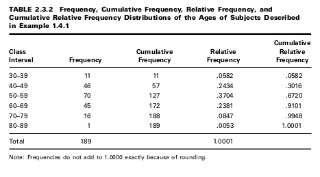
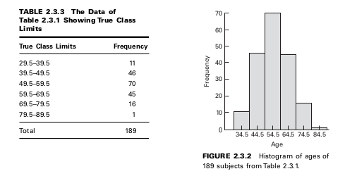
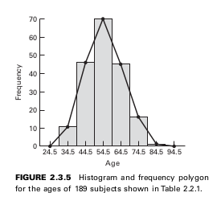
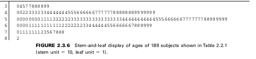

Estadistica Descriptiva
=======================

Arreglo ordenado
----------------

EXAMPLE 2.2.1

Table 1.4.1 contains a list of the ages of subjects who participated in the study on smoking cessation discussed in Example 1.4.1. As can be seen, this unordered table requires
considerable searching for us to ascertain such elementary information as the age of the
youngest and oldest subjects.

**2.3 GROUPED DATA: THE FREQUENCY DISTRIBUTION**

EXAMPLE 2.3.1
We wish to know how many class intervals to have in the frequency distribution of the
data. We also want to know how wide the intervals should be.

formula given by Sturges: :math:`k = 1 + 3.3221 (\log_{10} n)`, where k stands for the number of class intervals and n is the
number of values in the data set under consideration.

the class interval width is given by

.. math::

   w = \frac{R}{k}

where R (the range) is the difference between the smallest and the largest observation in
the data set

EXAMPLE 2.3.1

We wish to know how many class intervals to have in the frequency distribution of the
data. We also want to know how wide the intervals should be.

apply Sturges’s rule to obtain: k = 9

**Relative Frequencies**

**The Histogram**

**The Frequency Polygon**

**Stem-and-Leaf Displays**

EXERCISES

2.3.1

In a study of the oral home care practice and reasons for seeking dental care among individuals
on renal dialysis, Atassi (A-1) studied 90 subjects on renal dialysis. The oral hygiene status of all
subjects was examined using a plaque index with a range of 0 to 3 (0 = no soft plaque deposits,
3 = an abundance of soft plaque deposits). The following table shows the plaque index scores for
all 90 subjects.

(a) Use these data to prepare:

A frequency distribution

A relative frequency distribution

A cumulative frequency distribution

A cumulative relative frequency distribution

A histogram

A frequency polygon

(b) What percentage of the measurements are less than 2.00?

(c) What proportion of the subjects have measurements greater than or equal to 1.50?

(d) What percentage of the measurements are between 1.50 and 1.99 inclusive?

(e) How many of the measurements are greater than 2.49?

(f) What proportion of the measurements are either less than 1.0 or greater than 2.49?

(g) Someone picks a measurement at random from this data set and asks you to guess the value.
What would be your answer? Why?

(h) Frequency distributions and their histograms may be described in a number of ways depend-
ing on their shape. For example, they may be symmetric (the left half is at least approximately a
mirror image of the right half), skewed to the left (the frequencies tend to increase as the meas-
urements increase in size), skewed to the right (the frequencies tend to decrease as the measure-
ments increase in size), or U-shaped (the frequencies are high at each end of the distribution and
small in the center). How would you describe the present distribution?

2.4 DESCRIPTIVE STATISTICS:
MEASURES OF CENTRAL TENDENCY

**General Formula for the Mean**

.. math::

   \mu = \frac{\sum_{i=1}^N x_i}{N}

**The Sample Mean**

.. math::

   \bar{x} = \frac{\sum_{i=1}^n x_i}{n}

**Median**

**Skewness**

.. math::

   \bar{x} = \frac{\sqrt{n}\sum_{i=1}^n (x_i-\bar{x})^3}{(n-1)\sqrt{n-1}s^3}

EXAMPLE 2.4.6

Consider the three distributions shown in Figure 2.4.1. Given that the histograms repre-
sent frequency counts, the data can be easily re-created and entered into a statistical pack-
age. For example, observation of the “No Skew” distribution would yield the following
data: 5, 5, 6, 6, 6, 7, 7, 7, 7, 8, 8, 8, 8, 8, 9, 9, 9, 9, 10, 10, 10, 11, 11. Values can be

2.5 DESCRIPTIVE STATISTICS:
MEASURES OF DISPERSION

**The Range**

.. math::

   R = x_L - x_S

**The Variance**

.. math::

   s^2 = \frac{\sum_{i=1}^n (x_i - \bar{x})^2}{n-1}

**Standard Deviation**

**The Coefficient of Variation**

**Percentiles and Quartiles**

**Interquartile Range**

**Kurtosis**

.. math::

   \bar{x} = \frac{n \sum_{i=1}^n (x_i-\bar{x})^4}{(n-1)^2 s^4} -3

**Box-and-Whisker Plots**

