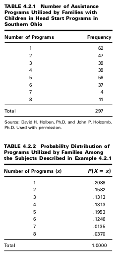

CHAPTER 4 PROBABILITY DISTRIBUTIONS
==========================

4.2 PROBABILITY DISTRIBUTIONS
OF DISCRETE VARIABLES

EXAMPLE 4.2.1
In an article appearing in the Journal of the American Dietetic Association, Holben et al.
(A-1) looked at food security status in families in the Appalachian region of southern Ohio.
The purpose of the study was to examine hunger rates of families with children in a local
Head Start program in Athens, Ohio. The survey instrument included the 18-question U.S.
Household Food Security Survey Module for measuring hunger and food security. In addi-
tion, participants were asked how many food assistance programs they had used in the last
12 months. Table 4.2.1 shows the number of food assistance programs used by subjects in
this sample.
We wish to construct the probability distribution of the discrete variable X, where
X = number of food assistance programs used by the study subjects.

