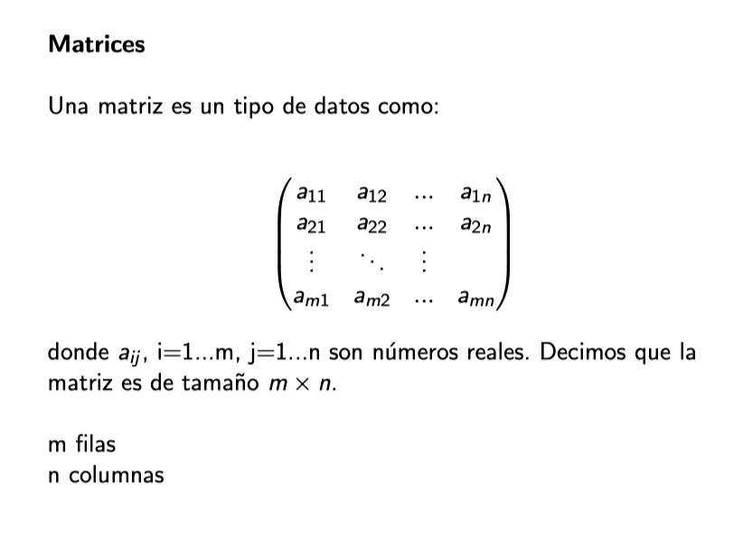

Matrices
========

Definir matrices en R
---------------------

Ejemplos
========

.. code:: R

   1:12
   matrix(1:12)

.. code:: R

   matrix(1:12, nrow = 3, ncol = 4)

.. code:: R
 
   matrix(1:12, nrow = 5, ncol = 4)

Utilizando funciones de R
-------------------------------------------------------------

``cbind()`` para unir vectores, usando cada uno como una columna.

``rbind()`` para unir vectores, usando cada uno como un renglón.

Ejemplos
========

.. code:: R

   vector_1 <- 1:4
   vector_2 <- 5:8
   vector_3 <- 9:12
   vector_4 <- 13:16

   matriz <- rbind(vector_1, vector_2, vector_3, vector_4)

   matriz <- cbind(vector_1, vector_2, vector_3, vector_4)

.. code:: R

   vector_1 <- 1:2
   vector_2 <- 1:3
   vector_3 <- 1:5

   matriz <- cbind(vector_1, vector_2, vector_3)

Propiedades de las matrices
----------------------------

.. code:: R

   mi_matriz <- matrix(1:10)

   class(mi_matriz)

   ## [1] "matrix"

.. code:: Bash

   mi_matriz <- matrix(1:12, nrow = 4, ncol = 3)
   dim(mi_matriz)
   ## [1] 4 3

Operaciones en Matrices
-----------------------

.. code:: Bash

    mi_matriz <- matrix(1:9, nrow = 3, ncol = 3)

    # Suma
    mi_matriz + 1

    # Multiplicación
    mi_matriz * 2

    # Potenciación
    mi_matriz ^ 3

.. code:: Bash

   matriz <- matrix(1:6, nrow = 3)

   matriz_t <- t(matriz)

Sacando elementos de una matriz
-------------------------------

.. code:: Bash

   m = matrix(1:12, ncol=3)

   m[2,3]

   m[2,]

   m[,3]

   m > 4

   m*(m>4)

Mostrando matrices como Imagenes
--------------------------------

.. code:: Bash

   # Datos
   x <- -10:10
   y <- -10:10
   z <- sqrt(outer(x ^ 2, y ^ 2, "+"))

   image(x, y, z)

.. code:: Bash

   m = matrix(1:12, ncol=3)

   image(m, col= gray.colors(12))

Arreglos
--------

Un arreglo es un tipo de dato que tiene la forma 

Ejemplos de Arreglos
--------------------

1)

.. code:: Bash

   m = array(1:24, dim=c(4,3,2))
   m

2)

.. code:: Bash

   library(RNifti)

   x = readNifti('func.nii.gz')

   dim(x)

   im = x[,,10,1]

   image(im)

