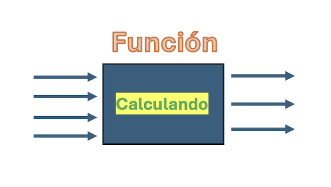

Funciones y Paquetes
====================

R esta formado de paquetes y cada uno de ellos resuelve un problema en particular. Los paquetes estan formados de 
constantes, datos,  funciones e informacion relacionada con el paquete.

**Una funcion es**

Funciones que manejan el ambiente:
----------------------------------

.. code:: R

   ls() 	- lista las variables que estan en memoria de R
   rm() 	- borra variables que estan en memoria de R
   getwd()	- en que folder estoy trabajando
   setwd()	- cambiar a folder de trabajo
   dir()	- lista archivos que estan en el directorio de trabajo

Algunas funciones matematicas:
------------------------------

.. code:: R

   log(3)	- calcula el logaritmo de 3
   sin(pi/2)	- calcula el seno de :math:`\pi/2`
   mean()       - calcula la media aritmetica
   sd()         - calcula la desviacion estandar

Ejercicios
----------

Verificar:

1. :math:`\lim_{\infty} \sqrt[n]{n} = 1`

2. :math:`\lim_{\infty} \frac{\log n}{n} = 0`

Calcular:

3. Sea :math:`\{ a_n \}` una sucesión tal que

.. math::

   a_{n+1} = \sqrt{1 + \sqrt{a_n}}, \text{ con } a_1 =1

Demostrar que la sucesión es convergente.

4. Sea :math:`a_n = \frac{n^n}{n!}` demostrar:

a) :math:`\lim_{\infty} \frac{a_{n+1}}{a_n} = e`

b) :math:`\lim_{\infty} \frac{n}{(n!)^{1/n}} = e`

