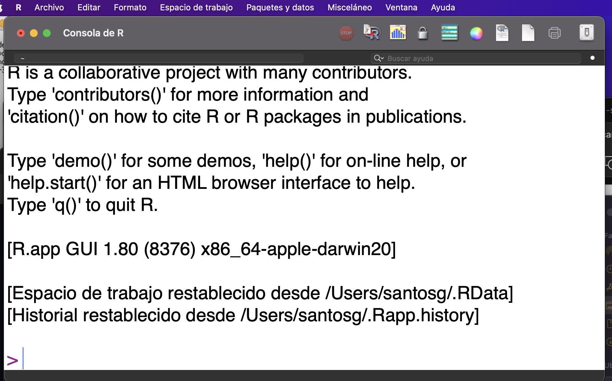
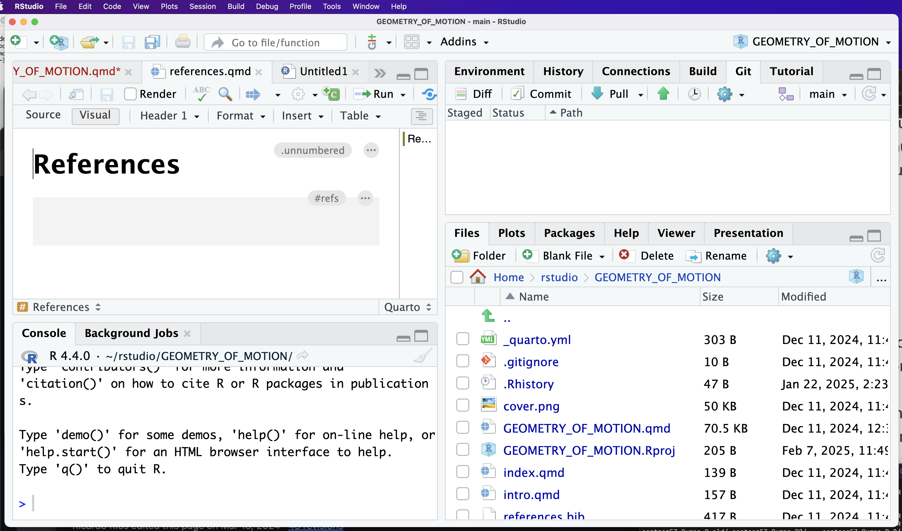

Herramienta de Desarrollo
=========================

- El codigo que se escribe en lenguaje R, se puede ejecutar dentro de un programa que es llamado **Ambente de Desarrollo (IDE)** o escribir el codigo en un editor de texto externo y ejecutar el codigo en un terminal en línea de comando.

- En **Windows**, R se instala como una aplicación de interfaz gráfica de usuario (GUI) con un conjunto de herramientas de desarrollo, como un editor integrado. También existe una aplicación GUI similar llamada **R.app** para Mac OS X. Sin embargo, estas aplicaciones son bastante básicas en comparación con los entornos de desarrollo integrados (IDE) para otros lenguajes de programación.

- Recientemente, hay muchos IDE independientes disponibles para R. Uno de los IDE más potentes es ``RStudio``.

- Algunos IDE's:

  * https://posit.co/download/rstudio-desktop/

  * https://code.visualstudio.com/download

Imagenes de Interfaces de IDE's
-------------------------------

