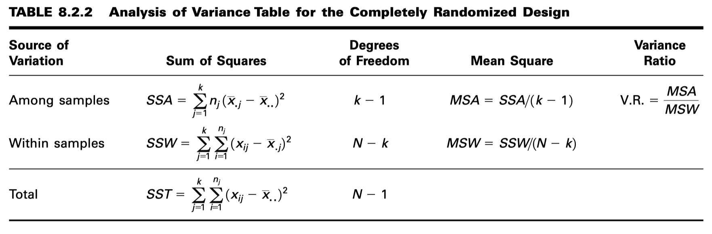
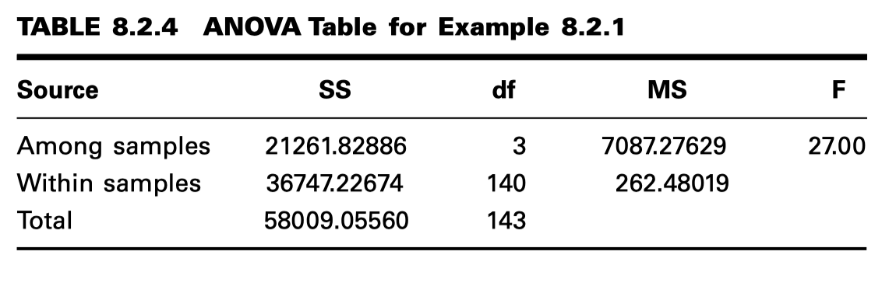

Analisis de Varianza
====================

**EL DISEÑO COMPLETAMENTE ALEATORIO**

.. math::

   \text{Tratamientos}

   \begin{matrix}
   & 1 & 2 & 3 & \cdots & k \\
   \hline
   & x_{11} & x_{12} & x_{13} & \cdots & x_{1k} & \\
   & x_{21} & x_{22} & x_{23} & \cdots & x_{2k} & \\
   & \vdots  & \vdots & \vdots & \vdots & \vdots & \\
   & x_{n_11} & x_{n_22} & x_{n_33} & \cdots & x_{n_kk} & \\
   \hline
   \text{Total} & T_{.1} & T_{.2} & T_{.3} & \cdots & T_{.k} & T_{..} \\
   \hline
   \text{Media} & \bar{x}_{.1} & \bar{x}_{.2} &\bar{x}_{.3} & \cdots & \bar{x}_{.k} & \bar{x}_{..} \\
   \end{matrix}

\hline
\text{Media} & \bar{x}_{.1} & \bar{x}_{.2} &\bar{x}_{.3} & \cdots & \bar{x}_{.k} & \bar{x}_{..}

\text{Total} & T_{.1} & T_{.2} & T_{.3} & \cdots & T_{.k} & T_{..}
\hline

**El Modelo**

Como ya se ha señalado, un modelo es una representación simbólica de un valor típico de un conjunto de datos. Para 
escribir el modelo para el diseño experimental completamente aleatorio, comencemos por identificar un valor típico del 
conjunto de datos representado por la muestra que se muestra en la Tabla 8.2.1. Usamos el símbolo :math:`x_{ij}` para 
representar 
este valor típico.

El modelo de análisis de varianza unidireccional se puede escribir de la siguiente manera:

.. math::

   x_{ij} = \mu + \tau_j + \epsilon_{ij}; \\ i = 1, 2, ... , n_j, j = 1, 2, .. , k

donde:

:math:`\mu` - representa la media de todas las k medias poblacionales y se denomina media general.

:math:`\tau_j` - representa la diferencia entre la media de la j-ésima población y la media general, y se denomina 
**efecto del tratamiento**.

:math:`\epsilon_{ij}` -  representa la cantidad en la que una medición individual difiere de la media de la población a 
la que pertenece y se denomina **término de error**.

**Hipótesis**

.. math::

   H_0: \mu_1 = \mu_2 = ... \mu_k

   H_A: \text{no todas las } \mu_j \text{ son iguales}

**EXAMPLE 8.2.1**

Las carnes de caza, incluidas las del venado cola blanca y la ardilla gris oriental, son consumidas por familias, 
cazadores y otras personas por motivos de salud, culturales o personales. Un estudio de David Holben (A-1) evaluó el 
contenido de selenio en la carne de venado cola blanca (venado) y ardilla gris (ardilla) criados en libertad, 
procedentes de una región de Estados Unidos con bajos niveles de selenio. Estos valores de selenio también se compararon 
con los de la carne de res producida dentro y fuera de la misma región. Queremos saber si los niveles de selenio 
difieren entre los cuatro grupos de carne.

**Decisión estadística.** Dado que nuestro valor F calculado de 27.00 es mayor que 3.95, rechazamos :math:`H_0`.

**valor p.** Dado que 27.00 > 3.95, p < .01 para esta prueba.

