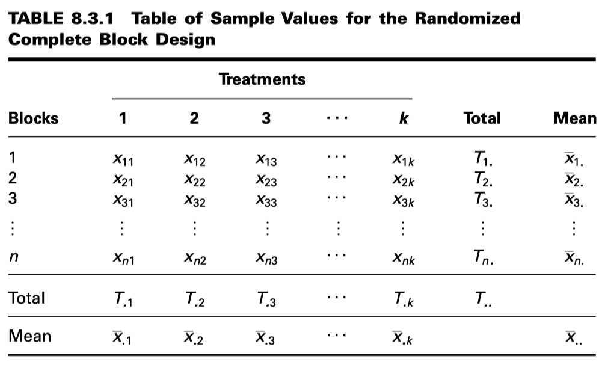
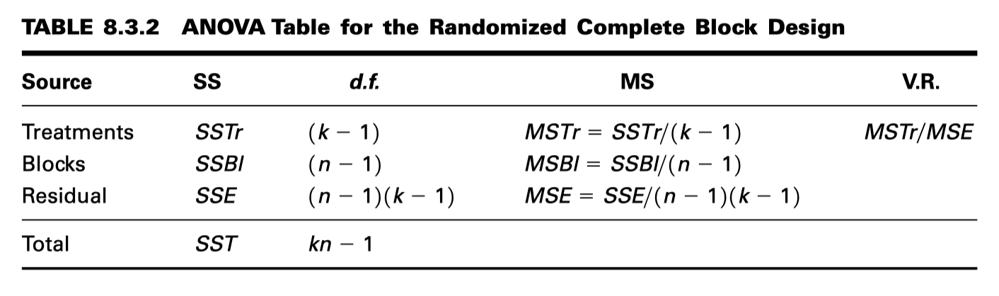
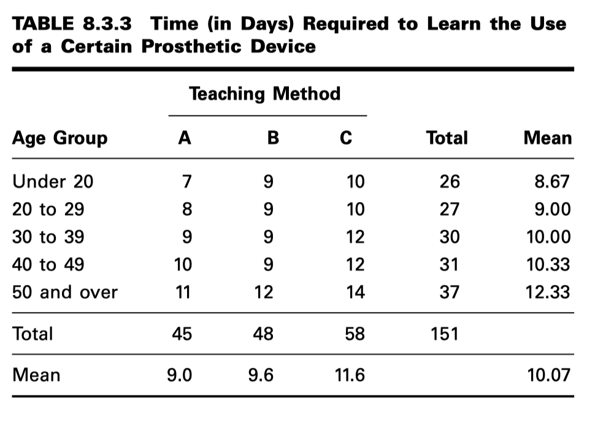
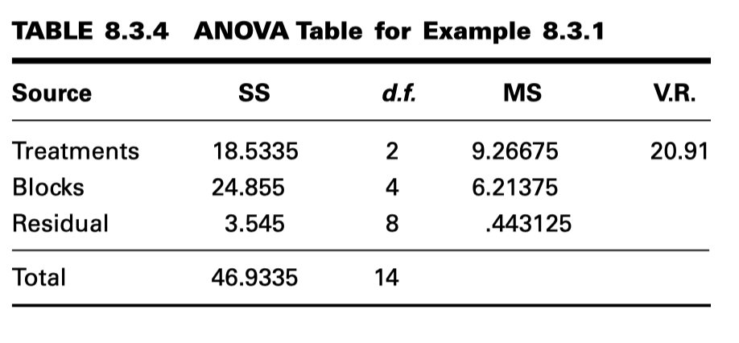
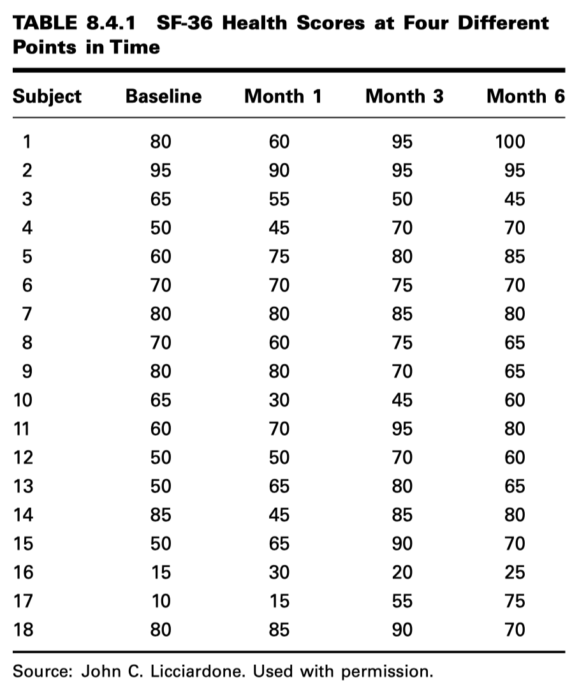

EL DISEÑO DE BLOQUES COMPLETO ALEATORIZADO
=========================================

* El diseño de bloques completos aleatorizados fue desarrollado alrededor de 1925 por R. A. Fisher, quien buscaba métodos para mejorar los experimentos de campo agrícolas. 

* Este diseño consiste en subdividir las unidades (denominadas unidades experimentales) a las que se aplican los tratamientos en grupos homogéneos llamados bloques, de manera que el número de unidades  experimentales en un bloque sea igual al número (o un múltiplo) de tratamientos que se estudian. 

* Los tratamientos se asignan aleatoriamente a las unidades experimentales dentro de cada bloque. Cabe destacar que cada tratamiento aparece en todos los bloques y cada bloque recibe todos los tratamientos.

En general, los datos de un experimento que utiliza el diseño de bloques completos aleatorizados pueden mostrarse en una tabla 
como la Tabla 8.3.1. 

**ANOVA de dos vías**

La técnica para analizar los datos de un diseño de bloques completos aleatorizados se denomina análisis de varianza 
bidireccional, ya que una observación se clasifica en función de dos criterios: el bloque al que pertenece y el grupo de 
tratamiento al que pertenece.

**The Model**

.. math::

   x_{ij} = \mu + \beta_i + \tau_j + \epsilon_{ij},  i = 1, 2, ... , n; j = 1, 2, ... , k

En este modelo:

* :math:`x_{ij}` es un valor típico de la población general.

* :math:`\mu` es una constante desconocida.

* :math:`\beta_i` representa un efecto de bloque que refleja el hecho de que la unidad experimental cayó en el i-ésimo bloque.

* :math:`\tau_j` representa un efecto del tratamiento, que refleja el hecho de que la unidad experimental recibió el j-ésimo tratamiento.

* :math:`\epsilon_{ij}` es un componente residual que representa todas las fuentes de variación distintas de los tratamientos y los bloques.

**Hipótesis** Se probara

.. math::

   H_0 : \tau_j = 0, j = 1, 2, ... , k

frente a la alternativa

.. math::

   H_A : \text{ not all } \tau_j = 0

**Estadística de Prueba**

La estadistica de prueba es **V.R**.

**Distribucióon de la Estadística de Prueba** Cuando :math:`H_0` es verdadera y se cumplen los supuestos, V.R. sigue una 
distribución F.

**Regla de decisión.** Rechazar la hipótesis nula si el valor calculado del estadístico de prueba V.R. es igual o mayor que el 
valor crítico de F.

**EXAMPLE 8.3.1**

Un fisioterapeuta deseaba comparar tres métodos para enseñar a los pacientes a usar una prótesis determinada. Consideraba que el 
ritmo de aprendizaje sería diferente para pacientes de distintas edades y quería diseñar un experimento en el que se pudiera 
tener en cuenta la influencia de la edad.

10. p value. For this test p 6 .005.

**EL DISEÑO DE MEDIDAS REPETIDAS**

Uno de los diseños experimentales más utilizados en el campo de las ciencias de la salud es el diseño de medidas repetidas.

**DEFINICION** Un diseño de medidas repetidas es aquel en el que se realizan mediciones de la misma variable en cada sujeto en dos o más 
ocasiones diferentes.

**EXAMPLE 8.4.1**

Licciardone et al. (A-15) examinaron a sujetos con dolor lumbar crónico inespecífico. En este estudio, 18 de los sujetos 
completaron un cuestionario que evaluaba su función física al inicio y después de 1, 3 y 6 meses. La Tabla 8.4.1 muestra los 
datos de estos sujetos que recibieron un tratamiento simulado que simulaba una manipulación osteopática genuina. Valores más 
altos indican una mejor función física. El objetivo del experimento era determinar si los sujetos reportarían mejoría con el 
tiempo, incluso si el tratamiento recibido proporcionara una mejoría mínima. Queremos saber si existe una diferencia en los 
valores promedio del cuestionario entre los cuatro momentos de evaluación.

**Decisión estadística** Ya que  V.R. = 5.50 es mayor que  2.80, Nosotras somos capaces de rechazar la hipótesis nula.

**Conclusión** Conclusion. Concluimos que existe una diferencia entre las medias de las cuatro poblaciones.

