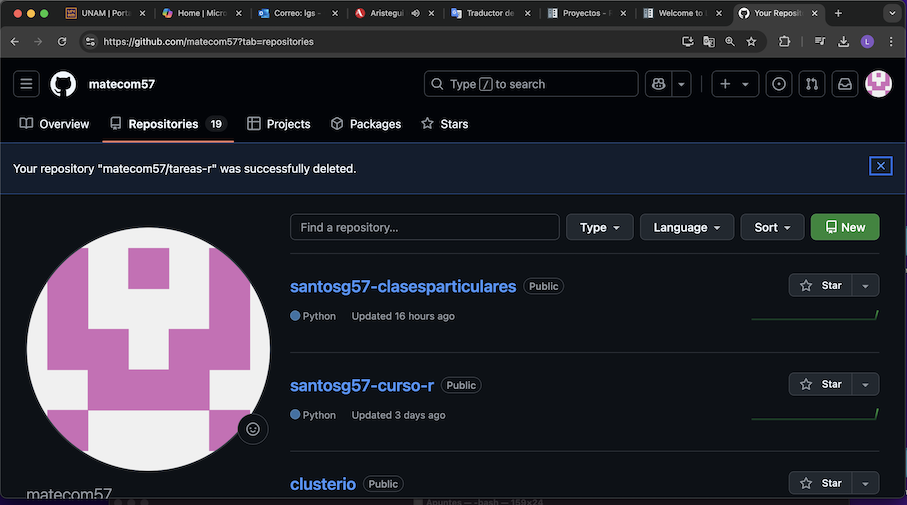
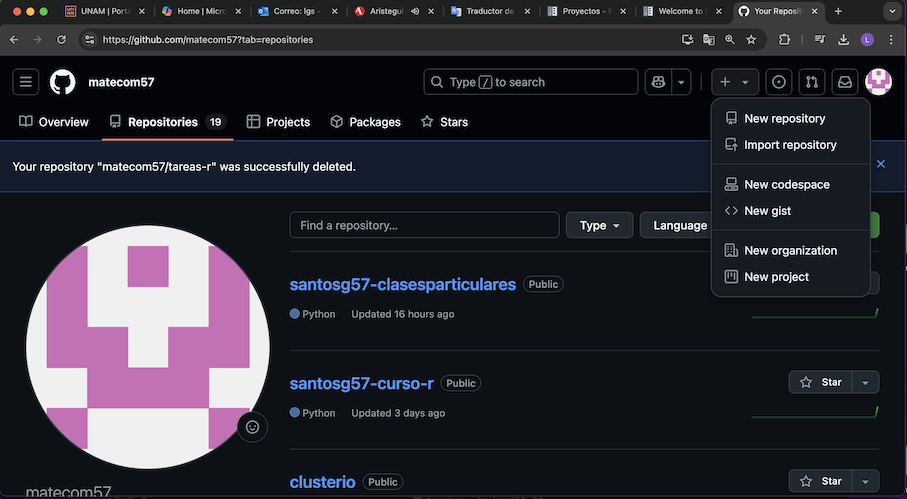
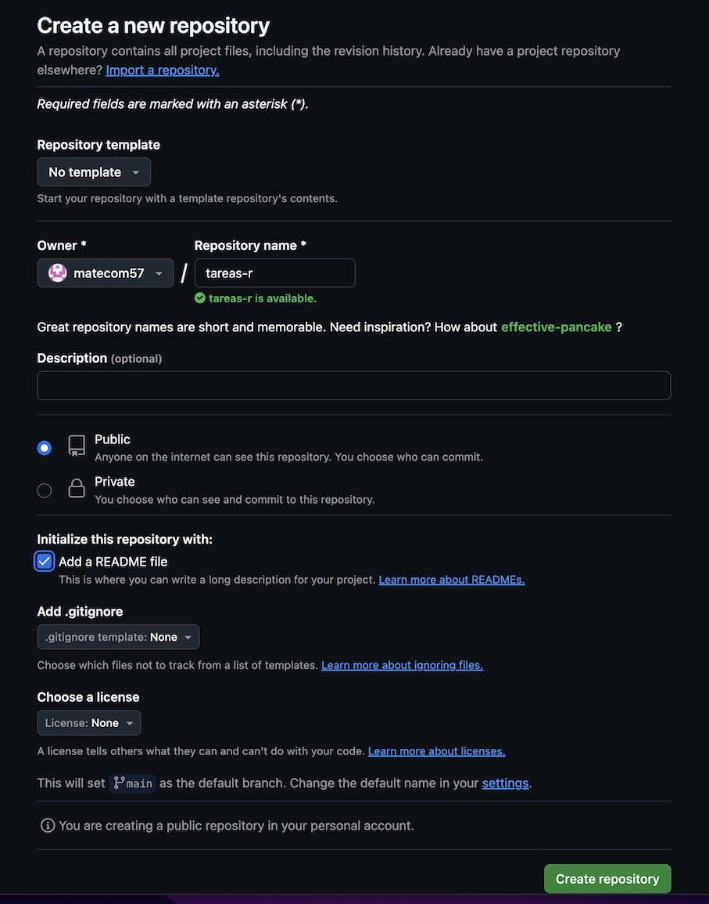
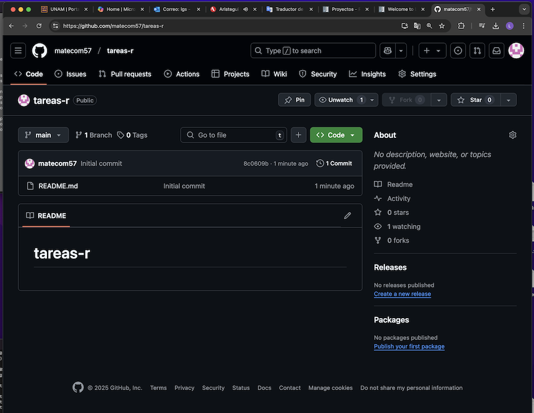

Github
======

**GitHub** es una plataforma en línea que permite a los desarrolladores crear, almacenar, compartir y mantener software. Es una comunidad de código 
abierto 
que facilita la colaboración entre usuarios. 

0. Crear un usario en https://github.com/login y entre a **github**.
 
Creando un Repositorio:
---------------------

1. En la pagina-imagen localize el botón **"+"**, esta en la parte superior derecha y pinchelo.

--------------------------------------------------------------

2. Se mostrara una lista de opciones, escoja "New repository".

--------------------------------------------------------------

3. Meta un nombre de repositotio en la caja de texto e inicialice el repositorio **"Add a README file"**

--------------------------------------------------------------

4. y con este creo el repositorio!

--------------------------------------------------------------

