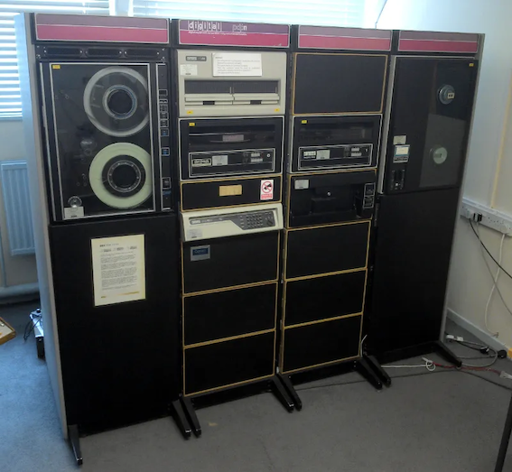
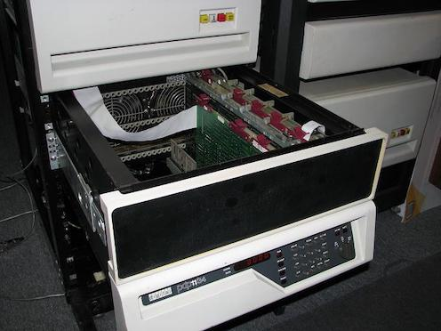

Historia
========

-------------------------------------------------------------------

-------------------------------------------------------------------

https://en.wikipedia.org/wiki/R_(programming_language)

R is a programming language for statistical computing and data visualization. It has been adopted in the fields of data mining, bioinformatics and data analysis.[9] 

The core R language is augmented by a large number of extension packages, containing reusable code, documentation, and sample data. 

R software is open-source and free software. It is licensed by the GNU Project and available under the GNU General Public License.[3] It is written primarily in C, Fortran, and R itself. Precompiled executables are provided for various operating systems. 

As an interpreted language, R has a native command line interface. Moreover, multiple third-party graphical user interfaces are available, such as RStudio—an integrated development environment—and Jupyter—a notebook interface. 

