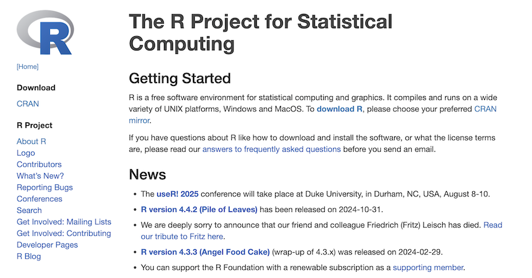
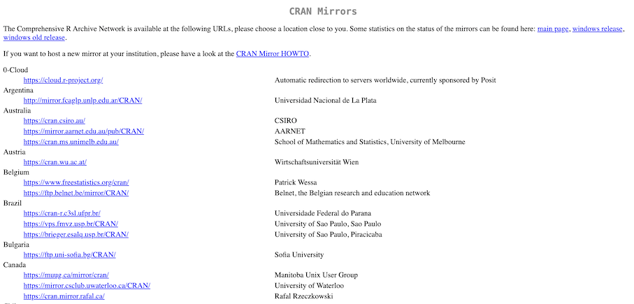
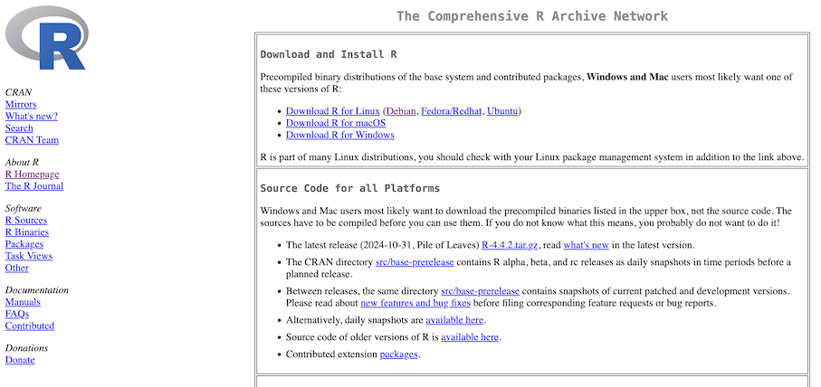
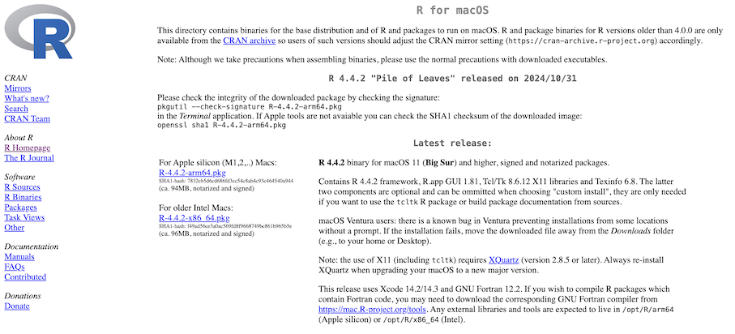
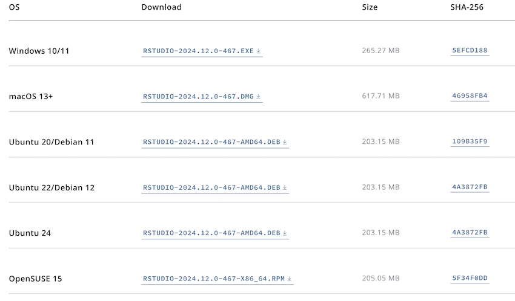

Instalación de R
================

Pagina donde se baja en Lenguaje R: https://www.r-project.org/

1. Vaya a **Download CRAN**

-----------------------------------------------

2. Algunos repositorios donde esta el Software R

-----------------------------------------------

3. Busquemos el repositorio: **México* y pichemos la liga

-----------------------------------------------

4. En esta página esta el Software para Windows, MAC y Linux. **En mi caso fue MAC**

-----------------------------------------------

5. Escogi el software de acuerdo al tipo de procesador que se tiene en mi computadora.

-----------------------------------------------

Instalacion RStudio
-------------------

https://posit.co/download/rstudio-desktop/

