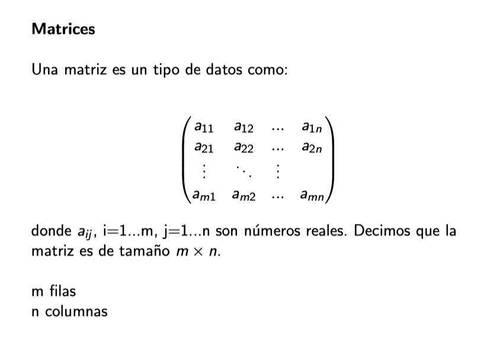

Matrices
========

Ejemplos
--------

.. code:: Bash

   1:12
   matrix(1:12)

.. code:: Bash

   matrix(1:12, nrow = 3, ncol = 4)

.. code:: Bash
 
   matrix(1:12, nrow = 5, ncol = 4)

Otra manera para crear matrices es utilizando las  funciones:
-------------------------------------------------------------

``cbind()`` para unir vectores, usando cada uno como una columna.

``rbind()`` para unir vectores, usando cada uno como un renglón.

Ejemplos
--------

.. code:: Bash

   vector_1 <- 1:4
   vector_2 <- 5:8
   vector_3 <- 9:12
   vector_4 <- 13:16

   matriz <- rbind(vector_1, vector_2, vector_3, vector_4)

   matriz <- cbind(vector_1, vector_2, vector_3, vector_4)

.. code:: Bash

   vector_1 <- 1:2
   vector_2 <- 1:3
   vector_3 <- 1:5

   matriz <- cbind(vector_1, vector_2, vector_3)

Propiedades de las matrices
----------------------------

.. code:: Bash

   mi_matriz <- matrix(1:10)

   class(mi_matriz)

   ## [1] "matrix"

.. code:: Bash

   mi_matriz <- matrix(1:12, nrow = 4, ncol = 3)
   dim(mi_matriz)
   ## [1] 4 3

Operaciones en Matrices
-----------------------

.. code:: Bash

    mi_matriz <- matrix(1:9, nrow = 3, ncol = 3)

    # Suma
    mi_matriz + 1

    # Multiplicación
    mi_matriz * 2

    # Potenciación
    mi_matriz ^ 3

.. code:: Bash

   matriz <- matrix(1:6, nrow = 3)

   matriz_t <- t(matriz)

Sacando elementos de una matriz
-------------------------------

.. code:: Bash

   m = matrix(1:12, ncol=3)

   m[2,3]

   m[2,]

   m[,3]

   m > 4

   m*(m>4)

Mostrando matrices como Imagenes
--------------------------------

.. code:: Bash

   # Datos
   x <- -10:10
   y <- -10:10
   z <- sqrt(outer(x ^ 2, y ^ 2, "+"))

   image(x, y, z)

.. code:: Bash

   m = matrix(1:12, ncol=3)

   image(m, col= gray.colors(12))

Ayuda con ``matrix``
-------------------

.. code::

   matrix {base}	R Documentation

   Matrices

   **Description**

   ``matrix``		creates a matrix from the given set of values.

   ``as.matrix`` 	attempts to turn its argument into a matrix.

   ``is.matrix`` 	tests if its argument is a (strict) matrix.

   **Usage**

   matrix(data = NA, nrow = 1, ncol = 1, byrow = FALSE,
       dimnames = NULL)

   as.matrix(x, ...)

   ## S3 method for class 'data.frame'

   as.matrix(x, rownames.force = NA, ...)

   is.matrix(x)

   **Arguments**

   **data**	an optional data vector (including a list or expression vector). Non-atomic classed R objects are coerced by as.vector and all attributes discarded.

   **nrow**	the desired number of rows.

   **ncol**	the desired number of columns.

   **byrow**	logical. If FALSE (the default) the matrix is filled by columns, otherwise the matrix is filled by rows.

   **dimnames**	a dimnames attribute for the matrix: NULL or a list of length 2 giving the row and column names respectively. An empty list is treated as NULL, and a list of length one as row names. The list can be named, and the list names will be used as names for the dimensions.

   **x** 	an R object.

   **...** 	additional arguments to be passed to or from methods.

   **rownames.force** logical indicating if the resulting matrix should have character (rather than NULL) rownames. The default, NA, uses NULL rownames if the data frame has ‘automatic’ row.names or for a zero-row data frame.

Arreglos - ``array``
--------

.. code::

   array {base}	R Documentation

   Multi-way Arrays

   Description

   Creates or tests for arrays.

   Usage

   array(data = NA, dim = length(data), dimnames = NULL)
   as.array(x, ...)
   is.array(x)

   Arguments

   data		a vector (including a list or expression vector) giving data to fill the array. Non-atomic classed objects are coerced by as.vector.

   dim		the dim attribute for the array to be created, that is an integer vector of length one or more giving the maximal  indices in each dimension.

   dimnames	either NULL or the names for the dimensions. This must be a list (or it will be ignored) with one component for each dimension, either NULL or a character vector of the length given by dim for that dimension. The list can be named, and the list names will be used as names for the dimensions. If the list is shorter than the number of dimensions, it is extended by NULLs to the length required.

   x		an R object.

   ...		additional arguments to be passed to or from methods.

Ejemplos de Arreglos
--------------------

.. code:: Bah

   m = array(1:24, dim=c(4,3,2))
   m
